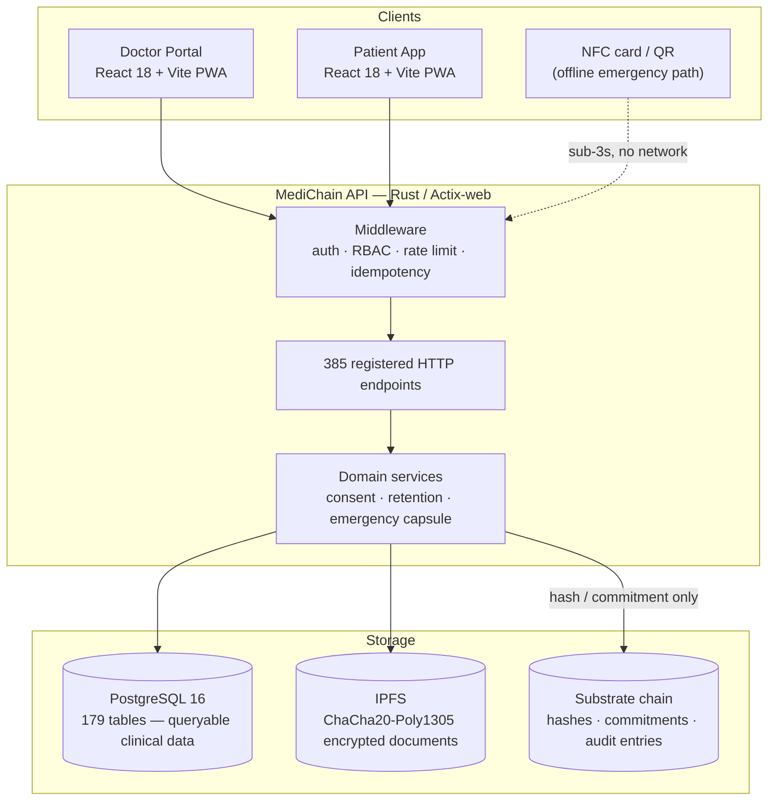

# MediChain

**A paramedic taps an NFC card and sees blood type, allergies and DNR status in under three seconds — with no internet connection.**

[](https://www.rust-lang.org/)
[](https://substrate.io/)
[](#testing)
[](LICENSE)

MediChain is a national health-ID and emergency medical records system for African
healthcare. Patients control who reads their records through blockchain-verified
consent; first responders get the handful of facts that decide whether someone
lives, without waiting on a network or a login.

> **Origin:** Rust Africa Hackathon 2026 (2nd place). Now being engineered toward
> production, including a formal POPIA legal review and a multi-week internal
> security assessment.

---

## Why this exists

A first responder arriving at a crash in Gauteng or Lagos typically knows nothing
about the patient in front of them. Not their blood type, not that penicillin will
kill them, not that they signed a DNR last year. Paper records are at a clinic
that is closed, or lost, or in another province.

The information that matters in the first ten minutes is small — a few hundred
bytes. The problem has never been storage. It is **trust and reach**: how does a
stranger with a phone prove they are allowed to read it, and how does it reach
them when the network is down?

MediChain's answer:

- **Reach** — the emergency subset is read from local storage on a tap. No chain
  round-trip, no patient interaction, no connectivity requirement.
- **Trust** — access requires a live professional work context, an approved
  device, and a freshly-issued server-side grant. Every read is logged with who,
  why, when, and *which fields were actually shown*.
- **Integrity** — the off-chain record is committed to on-chain as a hash, so
  tampering is detectable without publishing anything private to a ledger.

---

## How it works



**The load-bearing rule: no personal health information goes on-chain.** Only
hashes, commitments, pointers, public keys and audit entries. Encrypted documents
live in IPFS; queryable clinical data lives in PostgreSQL. An immutable ledger
cannot honour a correction or deletion request, so nothing that might need
correcting or deleting is put there.

Full diagrams — C4 context/container/component, the emergency-access sequence,
trust boundaries and the data model — are in
**[docs/architecture.md](docs/architecture.md)**.

---

## What is actually built

Verified against the codebase, not aspirational. Counts are reproducible with the
commands in [docs/architecture.md](docs/architecture.md#verifying-these-numbers).

| Area | State | Detail |
|---|---|---|
| **HTTP API** | Working | 386 handlers, 385 registered routes; `/api/v1` versioning, idempotency keys, cursor pagination, canonical error envelope |
| **Storage** | Working, dual backend | In-memory (default, ephemeral) and PostgreSQL (`MEDICHAIN_STORAGE=postgres`); 38 migrations → 179 tables. Both implement the same repository traits |
| **Blockchain** | Working, opt-in | Real `subxt` extrinsic submission when `BLOCKCHAIN_ENABLED=true` and an operator key is configured; deterministic placeholder hash otherwise. Every call returns `ChainTxResult { hash, finalized }` so callers can tell which they got |
| **Substrate node** | Real node | `node/` builds a genuine node (chain spec, service, RPC) on polkadot-sdk — not a mock |
| **Pallets** | Working | `access-control`, `medical-records`, `patient-identity` — 46 tests |
| **Crypto** | Working | ChaCha20-Poly1305 AEAD, Argon2id KDF, SHA3-256, Sr25519 signatures, zeroization on drop |
| **Emergency access** | Working | Grant-bound break-glass requiring live work context + approved device; short-lived signed NFC token exchange; field-level disclosure logging |
| **Consent / legal basis** | Working | POPIA §11 grounds, §32 health authorisation, §34/35 children's information, Children's Act §129 mature-minor rules — not a boolean |
| **Data retention** | Partial by design | Evaluation, legal holds, approval-gated execution, processing restriction, deletion register. **Irreversible deletion deliberately not built** — see [ADR-0005](docs/adr/0005-retention-restriction-before-deletion.md) |
| **Real-time (backend)** | Working | Server-Sent Events at `/api/events` |
| **Real-time (frontend)** | **Not wired** | No `EventSource` consumer exists yet. The backend pushes; nothing listens |
| **Frontend** | Substantial | 151 doctor-portal pages, 53 patient-app pages, shared typed API client |
| **Frontend tests** | Weak | The known gap. Backend is well covered; the UI is not |

### Known gaps, stated plainly

- **Frontend does not consume SSE.** The endpoint works; the clients ignore it.
- **Irreversible deletion is not implemented** — retention restricts and
  registers, which is reversible on purpose while retention periods await legal
  confirmation.
- **Authorization is not enforced at a single chokepoint.** Authentication is
  centralised; role and ownership checks are still per-handler across 386 routes.
- **49 integration/e2e tests do not run** — `tests/*.rs` belongs to no workspace
  member, so it is never compiled. Tracked in
  [docs/TECHNICAL_DEBT_REGISTER.md](docs/TECHNICAL_DEBT_REGISTER.md).
- **Real patient data is blocked** behind seven documented gates, four of which
  are not engineering tasks. See
  [docs/PRODUCTION_READINESS_GATES.md](docs/PRODUCTION_READINESS_GATES.md).

---

## Quick start

Requires Rust 1.97+, Node 20+, and Docker (only for the PostgreSQL path).

### Fastest path — no database, no chain, synthetic data

```bash
cargo build -p medichain-api --bin medichain-api
bash scripts/run-synthetic-local.sh          # API on http://127.0.0.1:8080
```

In another shell, exercise it end to end:

```bash
bash scripts/synthetic-e2e-test.sh           # 40 assertions
```

This runs in-memory: state is discarded on restart, no third-party API keys are
read, and `BLOCKCHAIN_ENABLED=false`. It is the intended way to demo or evaluate
the system without provisioning anything.

### PostgreSQL path

```bash
docker compose -p medichain_horizon \
  -f docker-compose.yml -f docker-compose.horizon-isolated.yml up -d postgres

bash scripts/run-synthetic-postgres.sh       # API on http://127.0.0.1:8091
BASE=http://127.0.0.1:8091 bash scripts/synthetic-e2e-test.sh
```

Migrations run on boot. The isolated compose project is deliberately separate
from any local dev stack — distinct container names, volume, credentials, and
loopback-only port `55432`.

> **Port note:** the API defaults to 8080, which collides with the IPFS gateway.
> The Postgres script uses 8091 to avoid the ambiguity.

### Frontend

```bash
cd client && npm install
npm run dev:doctor      # http://localhost:5173
npm run dev:patient     # http://localhost:5174
```

Full setup, environment variables and troubleshooting:
**[docs/SETUP_AND_RUNNING.md](docs/SETUP_AND_RUNNING.md)**.

---

## Testing

```bash
cargo test -p medichain-api --bin medichain-api    # 305 tests
cargo test -p pallet-access-control                # 19
cargo test -p pallet-medical-records               # 17
cargo test -p pallet-patient-identity              # 10
bash scripts/synthetic-e2e-test.sh                 # 40 live-API assertions
```

**351 automated tests pass** (305 API + 46 pallet), plus 40 end-to-end assertions
against a running server. Four of the 305 require a live PostgreSQL and are
skipped without one:

```bash
DATABASE_URL=postgres://... cargo test -p medichain-api --bin medichain-api
```

This machine needs the GNU toolchain (`RUSTUP_TOOLCHAIN=stable-x86_64-pc-windows-gnu`)
— see [CONTRIBUTING.md](CONTRIBUTING.md).

---

## Security and compliance

Security here is evidenced rather than asserted.

- **[SECURITY.md](SECURITY.md)** — posture, cryptographic choices, responsible disclosure.
- **[docs/PRODUCTION_READINESS_GATES.md](docs/PRODUCTION_READINESS_GATES.md)** — the seven
  conditions that gate real patient data, derived from a POPIA / National Health Act /
  Children's Act legal review.
- **[docs/adr/](docs/adr/)** — Architecture Decision Records, including why plaintext
  emergency fields were removed from chain storage.
- **[docs/SECURITY_ASSESSMENT.md](docs/SECURITY_ASSESSMENT.md)** — how an internal,
  authorized security assessment was run against an isolated synthetic environment,
  and what it changed. Target-specific findings are deliberately not published.

Highlights of what that assessment changed: on-chain plaintext health fields
replaced with commitments; keyed digests for national-ID hashes; a replayable NFC
credential replaced with short-lived signed tokens; plaintext staff PII removed;
`sqlx` upgraded to close a reachable CVE.

Standards applied: **NASA Power of 10** (bounded loops, no recursion, functions
≤ 60 lines, assertions on invariants) and parameterised SQL only — zero string
concatenation in queries.

---

## Repository map

| Path | Contents |
|---|---|
| `api/` | Rust API — handlers, middleware, repositories, domain services, migrations |
| `pallets/` | Substrate pallets: access-control, medical-records, patient-identity |
| `runtime/`, `node/` | Substrate runtime and node |
| `crypto/` | `medichain-crypto` — AEAD, KDF, zeroization |
| `client/` | `doctor-portal`, `patient-app`, `shared` (typed API client) |
| `docs/` | Architecture, ADRs, API reference, OpenAPI spec, runbooks, compliance |
| `scripts/` | Run scripts, synthetic test harness, backup/restore |
| `.horizon/` | Security-campaign state, coverage ledger, findings (private) |

Documentation index: **[docs/README.md](docs/README.md)**.

---

## Contact

**Keorapetswe Kgoatlha** — Founder & Engineer
kkgawatlh9@gmail.com
[github.com/Lukau-Tech-Invasion/medichain](https://github.com/Lukau-Tech-Invasion/medichain)

---

## Licence

**Proprietary** — see [LICENSE](LICENSE). Viewing this repository and running it
locally with synthetic data to evaluate it are permitted; copying, modification,
redistribution and any production or clinical use require written permission.

The repository is public deliberately. A system that asks hospitals and a health
ministry to trust it with national health data should be inspectable, and the
documented reason previous South African digitisation efforts stalled was a lack
of trust in vendor-held infrastructure — not a lack of technology.

**Intended direction: source-available core.** The federation protocol, health-ID
and emergency-access layers are the parts a ministry or hospital would need to
audit and self-host, and the intent is to open those under a permissive licence
once there is a first production deployment to anchor it against. The commercial
layer stays licensed. That sequencing is deliberate: an open licence cannot be
withdrawn from code already published, so it is granted once rather than
provisionally.

---

© 2025–2026 Lukau Invasion (Pty) Ltd. All rights reserved. Developed originally
for the Rust Africa Hackathon 2026 (2nd place); proprietary thereafter.
