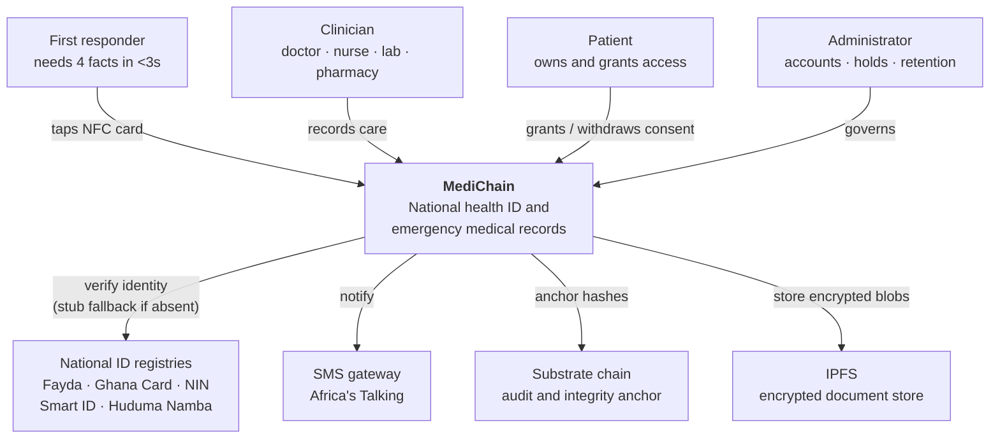
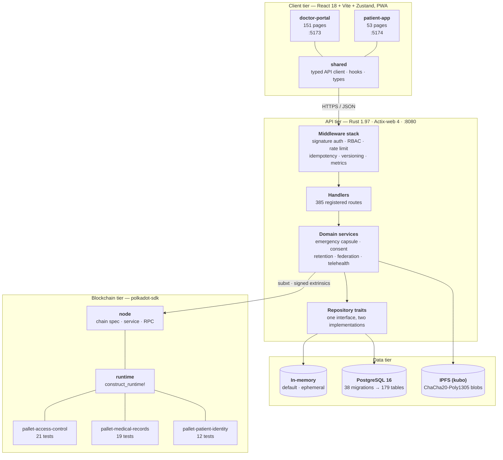
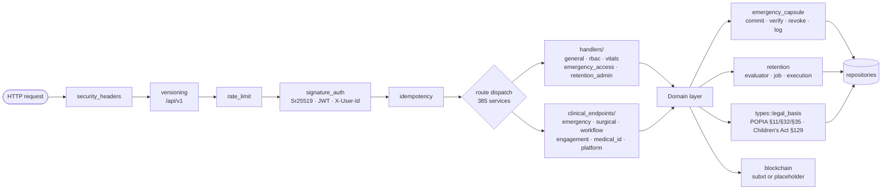
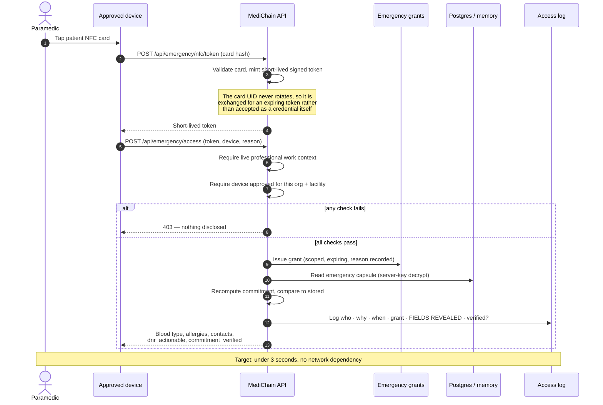
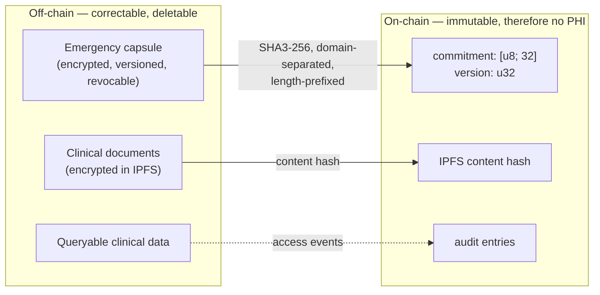
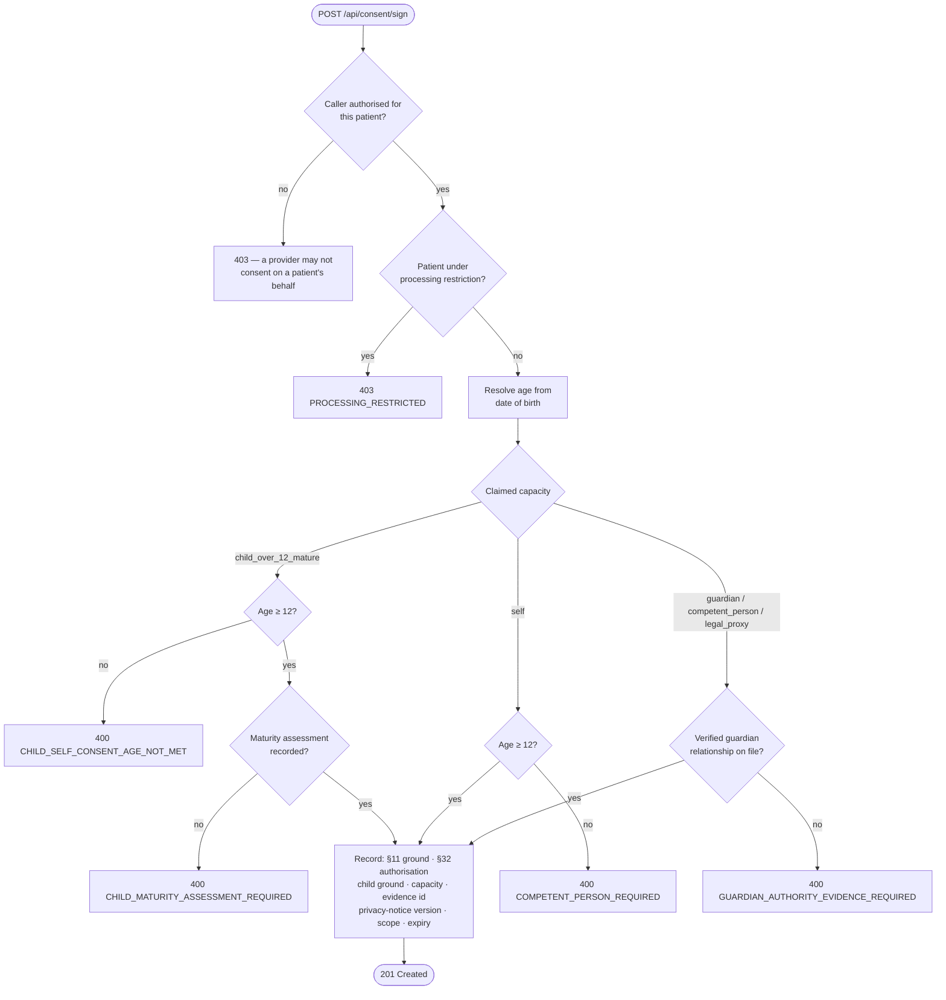
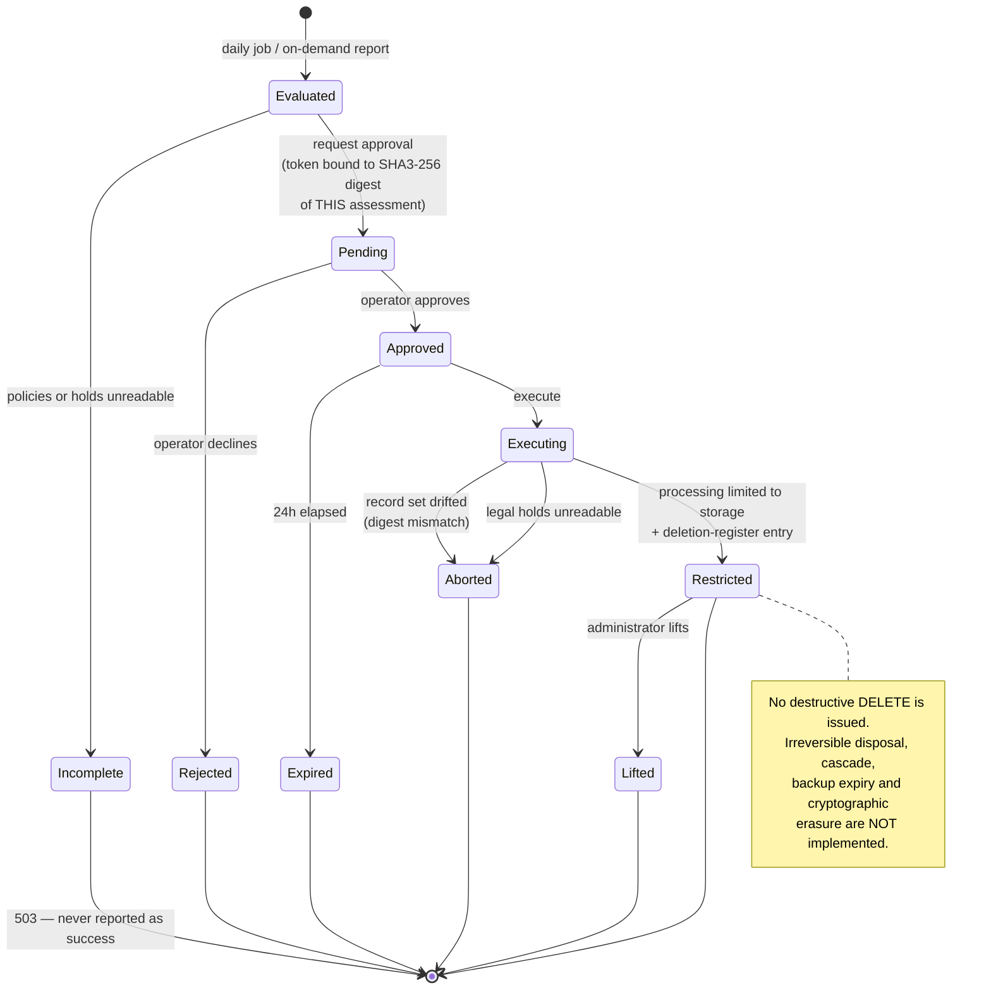
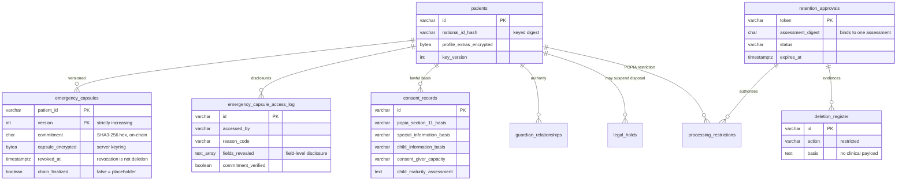
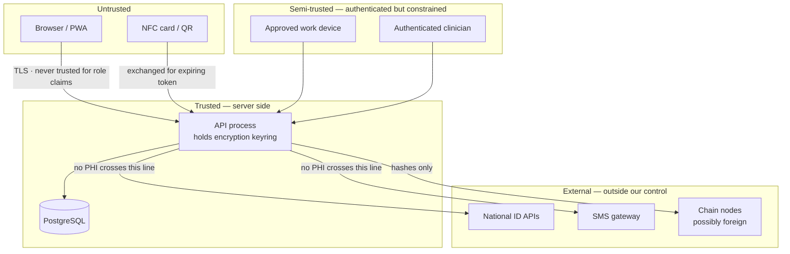

# MediChain Architecture

© 2025–2026 Lukau Invasion (Pty) Ltd. All rights reserved.

**Last verified against the codebase: 2026-07-29.** Every count in this document
is reproducible — see [Verifying these numbers](#verifying-these-numbers).

This document follows the [C4 model](https://c4model.com/): system context, then
containers, then components, then the sequences that matter. Diagrams are Mermaid
so they render natively on GitHub with no external assets and stay diffable in
review.

Architecture *decisions* — the reasoning behind these structures, and the options
rejected — live in [`docs/adr/`](adr/).

---

## Table of contents

- [1. System context (C4 L1)](#1-system-context-c4-l1)
- [2. Containers (C4 L2)](#2-containers-c4-l2)
- [3. API components (C4 L3)](#3-api-components-c4-l3)
- [4. The emergency path](#4-the-emergency-path)
- [5. Where data lives, and why](#5-where-data-lives-and-why)
- [6. Consent and lawful basis](#6-consent-and-lawful-basis)
- [7. Retention lifecycle](#7-retention-lifecycle)
- [8. Core data model](#8-core-data-model)
- [9. Trust boundaries](#9-trust-boundaries)
- [10. Quality attributes and constraints](#10-quality-attributes-and-constraints)
- [Verifying these numbers](#verifying-these-numbers)

---

## 1. System context (C4 L1)

Who uses MediChain and what it depends on.



Every external dependency is **optional at runtime**. Absent a national-ID API
key the verifier falls back to a stub and reports `verification_method: Stub`
rather than implying a verification happened. Absent a chain the API records a
deterministic placeholder hash and reports `finalized: false`. This is what makes
the system demonstrable on a laptop with no credentials, and it is deliberate —
a clinical system that cannot function when a third party is down is not a
clinical system.

---

## 2. Containers (C4 L2)



### Why two storage backends

The in-memory backend is not a toy. It is the default, it implements the same
`repositories::traits` interfaces as PostgreSQL, and it is what makes the system
runnable with a single command for a demo or an evaluation. PostgreSQL is the
production path. Both are exercised by the same test suite.

The cost of that choice is real and was paid during testing: the two
implementations can drift. A double-revoke bug existed in the in-memory capsule
repository while PostgreSQL correctly refused it — the guard lived in SQL rather
than in the trait contract. See [ADR-0001](adr/0001-dual-storage-backends.md).

---

## 3. API components (C4 L3)



**Structural note — authorization is per-handler.** Authentication is
centralised in middleware; role and ownership checks are made in each handler.
Live testing during the internal assessment confirmed those checks hold:
cross-patient IDOR attempts against patient records and vitals returned 403, and
of the 386 handlers, every one authenticates, authorizes, or is a justified
public route. A static scan initially suggested dozens were "open"; probing the
running server with no credentials reduced that to one real bug
(`simulate-nfc-tap`, since fixed and demo-gated — HZ-019) plus one open compute
endpoint (`translate`, since gated).

So the per-handler pattern is not a present vulnerability. Its weakness is
maintainability: without a single chokepoint, a *new* handler can forget to
check. That gap is closed at build time by `scripts/check-endpoint-auth.py`,
wired into CI as a hard gate — a new handler with no auth decision, and not on
the justified allowlist, fails the build. A runtime chokepoint refactor across
all 386 handlers remains a possible future hardening, but the enforceable
invariant now exists without it.

---

## 4. The emergency path

This is the sequence the product exists for. Note what is **absent**: no patient
interaction, no chain round-trip, no decryption key held by the patient.



Two design details worth calling out:

**`dnr_actionable` is returned separately from the raw `dnr_status` flag.** A DNR
reads as actionable only when it is recorded, verified, *and* not revoked. An
unverified or withdrawn directive reads as "resuscitate", because wrongly
withholding resuscitation is not a recoverable error.

**A failed integrity check does not withhold the data.** If the stored capsule no
longer matches its commitment, the response still carries the clinical facts and
sets `commitment_verified: false`, and the discrepancy is logged at error level.
A responder who needs a blood type now is not helped by a blank screen; the
investigation happens afterwards.

---

## 5. Where data lives, and why

**No personal health information goes on-chain.** The ledger holds only hashes,
commitments, pointers, public keys and audit entries.

| Data | Location | Rationale |
|---|---|---|
| Emergency capsule (blood type, organ donor, DNR + provenance) | PostgreSQL, encrypted under the **server** keyring | Must be readable in an emergency without the patient online to approve a decryption |
| Capsule commitment + version | On-chain | 32-byte digest makes off-chain tampering detectable without publishing the values |
| Clinical documents | IPFS, ChaCha20-Poly1305 | Content-addressed, encrypted at rest |
| IPFS content hash | On-chain | Proves the document has not been swapped |
| Queryable clinical data | PostgreSQL | Needs indexes, joins, reporting — a ledger cannot serve this |
| National ID | Keyed digest only | Never stored in the clear; keyed so digests are not brute-forceable |
| Access audit entries | PostgreSQL + on-chain | Off-chain for query, on-chain for immutability |



This split is the direct consequence of a legal finding: an immutable ledger
cannot satisfy POPIA's correction, deletion and retention-limitation duties, and
pseudonymity does not cure it because an account may later correlate to a real
person. Plaintext `blood_type` / `organ_donor` / `dnr_status` were therefore
removed from pallet storage in favour of a commitment.
See [ADR-0004](adr/0004-commitment-not-plaintext-on-chain.md).

---

## 6. Consent and lawful basis

A `consent_recorded: true/false` boolean is legally insufficient. POPIA §11
recognises multiple lawful grounds beyond consent, health data additionally needs
a §32 authorisation, and a minor's information layers §34/§35 on top of that —
while the Children's Act governs treatment consent separately.



A mature child's own consent is recorded as `s129_mature_child_self_consent`,
**not** as competent-person consent — "the child consented" and "a guardian
consented" are different legal facts and must not collapse into one flag.

---

## 7. Retention lifecycle

Retention *evaluates* and *restricts*. It does not delete. That boundary is
deliberate: the retention periods await formal legal confirmation, so the first
thing built on top of them is reversible.



The digest binding is the load-bearing control: without it, approving a report of
three records could execute against three thousand, and the approval would be
genuine but meaningless.

---

## 8. Core data model

The emergency and compliance tables — the ones this architecture turns on. The
full schema is 179 tables; see [`database-schema.md`](database-schema.md).



---

## 9. Trust boundaries



Rules that hold at every boundary:

1. **Roles come from the server-side user record, never from a client header
   claim.** `X-User-Id` identifies; it does not authorise.
2. **No PHI crosses into an external system.** National-ID calls send a digest;
   SMS carries no clinical content; the chain receives hashes.
3. **Cross-border replication is a live compliance question.** Chain nodes may
   run outside South Africa, which POPIA treats as a transborder transfer
   requiring assessment — tracked in
   [`GOVERNANCE_RECORD.md`](GOVERNANCE_RECORD.md).

---

## 10. Quality attributes and constraints

| Attribute | Target | How it is achieved |
|---|---|---|
| **Emergency latency** | < 3 s, offline | Local read, no chain call, no patient round-trip |
| **Safety** | NASA Power of 10 | No recursion, bounded loops, functions ≤ 60 lines, assertions on invariants |
| **Confidentiality** | Encrypted at rest | ChaCha20-Poly1305 AEAD, Argon2id KDF, keyring versioning for rotation |
| **Integrity** | Tamper-evident | SHA3-256 commitments, domain-separated and length-prefixed so no two distinct inputs share a digest |
| **Injection resistance** | Zero string-built SQL | `sqlx` with bound parameters only |
| **Auditability** | Field-level | Every emergency disclosure records which fields were shown |
| **Availability** | Degrade, don't fail | Every external dependency optional; chain/ID failures are non-fatal and honestly reported |

### Deliberate non-goals

- **Not** a general EHR replacement. The emergency subset is the wedge.
- **Not** a public ledger of health data. If it must be correctable, it is off-chain.
- **Not** claiming production readiness for real patient data — seven gates
  block that, four of which no code can close.

---

## Verifying these numbers

```bash
# HTTP handlers and registered routes
grep -rhoE '#\[(get|post|put|patch|delete)\("' --include=*.rs api/src | wc -l   # 386
grep -c '\.service(' api/src/routes.rs                                          # 385

# Migrations, and tables in a migrated database
ls api/migrations/*.sql | wc -l                                                 # 38
psql -tAc "SELECT count(*) FROM information_schema.tables
           WHERE table_schema='public';"                                        # 179

# Frontend pages
find client/doctor-portal/src/pages -name '*.tsx' | wc -l                       # 151
find client/patient-app/src/pages   -name '*.tsx' | wc -l                       # 53

# Tests
cargo test -p medichain-api --bin medichain-api                                 # 305
for p in access-control medical-records patient-identity; do
  cargo test -p pallet-$p 2>&1 | grep 'test result'; done                       # 21, 19, 12
cargo test -p medichain-crypto 2>&1 | grep 'test result'                        # 23
bash scripts/synthetic-e2e-test.sh                                              # 40 assertions
```

---

## Related documents

| Document | Purpose |
|---|---|
| [`adr/`](adr/) | Architecture Decision Records — the *why* |
| [`api.md`](api.md) / [`openapi.yaml`](openapi.yaml) | Endpoint reference and machine-readable spec |
| [`database-schema.md`](database-schema.md) | Full schema |
| [`PRODUCTION_READINESS_GATES.md`](PRODUCTION_READINESS_GATES.md) | What blocks real patient data |
| [`../SECURITY.md`](../SECURITY.md) | Security posture and disclosure policy |
| [`TECHNICAL_DEBT_REGISTER.md`](TECHNICAL_DEBT_REGISTER.md) | Known debt, deferred deliberately |
| [`BLOCKCHAIN_OPERATIONS.md`](BLOCKCHAIN_OPERATIONS.md) | Node and chain operations |
| [`INCIDENT_RESPONSE.md`](INCIDENT_RESPONSE.md) | Incident playbook |
