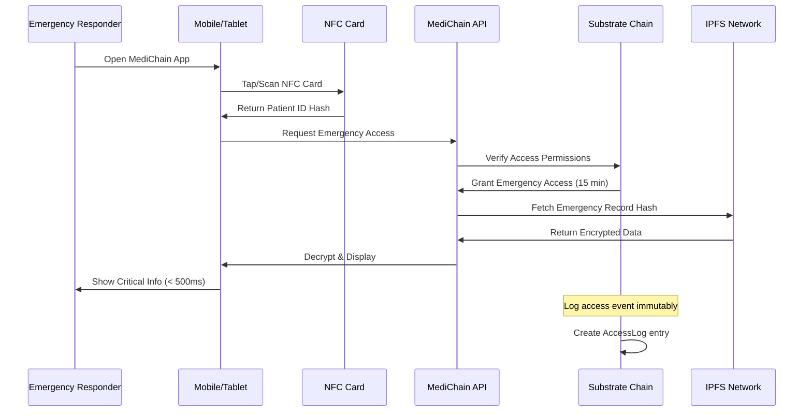
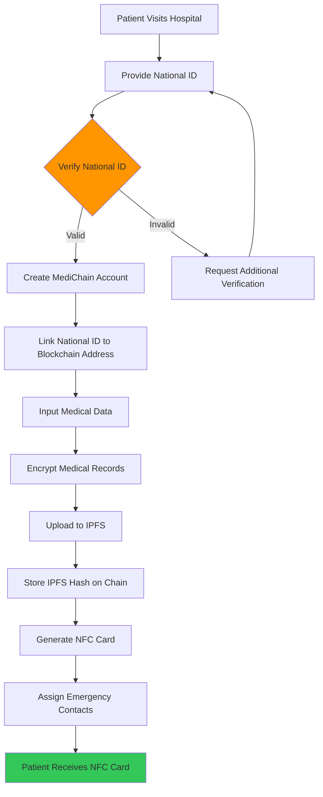
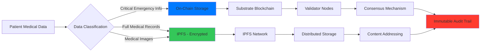
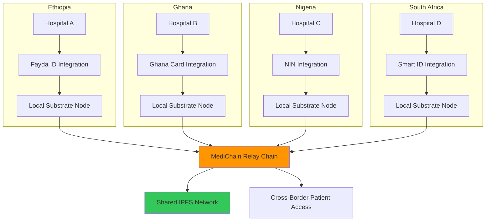
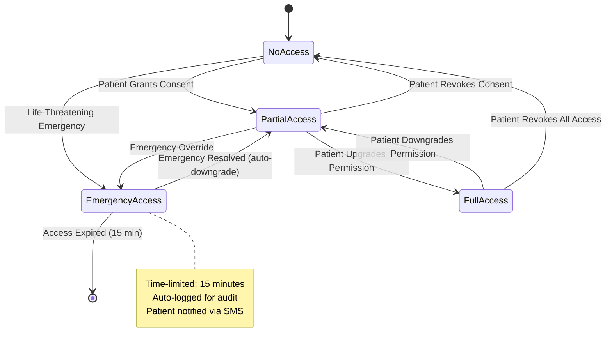

# 🏥 MEDICHAIN - COMPLETE HACKATHON MASTER PLAN

**Emergency Medical Records via National ID + NFC Card**

---

## 📋 TABLE OF CONTENTS

1. [Executive Summary](#executive-summary)
2. [Market Analysis](#market-analysis)
3. [Competitive Landscape](#competitive-landscape)
4. [Technical Architecture](#technical-architecture)
5. [System Architecture Diagrams](#system-architecture-diagrams)
6. [Code Templates](#code-templates)
7. [UI/UX Design](#uiux-design)
8. [MVP Specifications](#mvp-specifications)
9. [Development Timeline](#development-timeline)
10. [Demo Script](#demo-script)
11. [Presentation Slides](#presentation-slides)
12. [Judging Criteria Optimization](#judging-criteria-optimization)
13. [Risk Mitigation](#risk-mitigation)
14. [Learning Resources](#learning-resources)
15. [Post-Hackathon Roadmap](#post-hackathon-roadmap)
16. [Pre-Hackathon Checklist](#pre-hackathon-checklist)

---

## 🎯 EXECUTIVE SUMMARY

### The Problem
Disease outbreaks in Africa have risen by over 41% between 2022 and 2024, yet emergency responders lack instant access to patient medical history during critical moments. Paper records are lost, cloud systems require internet, and existing solutions don't integrate with national identity systems.

### The Solution
**MediChain** - A blockchain-based emergency medical records system where a simple NFC card tap provides instant access to life-saving patient data, integrated with African national ID systems (Fayda ID, Ghana Card, NIN).

### Why It Wins

| Factor | Evidence |
|--------|----------|
| **Market Alignment** | Africa CDC committed to digitalizing 90% of Primary Health Care systems by 2035 |
| **Market Size** | $40 billion annual market for Electronic Medical Records in Africa |
| **Government Support** | National IDs (Fayda, Ghana Card) already being integrated into healthcare |
| **Technical Edge** | Rust + Substrate = unbeatable performance (< 500ms access time) |
| **Social Impact** | Directly saves lives in emergency situations |
| **Differentiator** | First blockchain-based system integrated with African national IDs |

### Hackathon Details
- **Event:** Rust Africa Hackathon 2026
- **Dates:** January 4-18, 2026 (2 weeks)
- **Track:** Fintech & Inclusive Finance OR Infrastructure & Connectivity
- **Team:** Solo
- **Prize:** $3,000 USD (1st place)

---

## 📊 MARKET ANALYSIS

### Healthcare Crisis in Africa

**Key Statistics:**
- Disease outbreaks increased by 41% (2022-2024)
- $40 billion annual EMR market
- 542 million Africans lack identity cards, hindering healthcare access
- Africa CDC targets 90% PHC digitalization by 2035

### Digital Identity Infrastructure

**Ethiopia - Fayda ID:**
- Targets 1 million refugees and internally displaced persons
- Being integrated into healthcare for patient registry and health records

**Ghana - Ghana Card:**
- Integrated with National Health Insurance Scheme
- Biometric identification system already deployed

**Nigeria - NIN (National Identification Number):**
- 100+ million enrollments
- Government pushing healthcare integration

**South Africa - Smart ID:**
- Most advanced system in Africa
- Ready for healthcare interoperability

### Healthcare Digitalization Initiatives

**HealthConnekt Africa:**
- Aims to connect 100,000 health facilities by 2030
- MediChain can plug into this infrastructure

**Africa on FHIR:**
- Interoperability initiative for healthcare data
- MediChain will be FHIR-compliant

---

## 🏆 COMPETITIVE LANDSCAPE

### Existing Solutions

#### 1. MedTrack (Ghana)
**Strengths:**
- Connected to Ghana Card (national biometric ID)
- Government backing
- Proven in-country deployment

**Weaknesses:**
- Not blockchain-based (centralized)
- Limited to Ghana only
- No emergency NFC access
- Requires internet connection

#### 2. Cloud-Based EMRs
**Examples:** Allof Health, various international systems

**Weaknesses:**
- Require constant internet
- Slow access in emergencies
- Poor interoperability between countries
- Proprietary/closed systems

#### 3. NFC Medical ID Cards (Knock ID, Tap2Tag)
**Weaknesses:**
- Cloud-based, not blockchain
- No national ID integration
- Limited to basic emergency info
- Not pan-African

### MediChain's Competitive Advantages

| Feature | Competitors | MediChain |
|---------|-------------|-----------|
| **National ID Integration** | ❌ None or country-specific | ✅ Multi-country (Fayda, Ghana Card, NIN) |
| **Blockchain Security** | ❌ Centralized cloud | ✅ Substrate + IPFS |
| **Emergency Access** | ⚠️ Some NFC | ✅ NFC + QR + PIN fallback |
| **Offline Capability** | ❌ Requires internet | ✅ Critical data cached locally |
| **Pan-African Design** | ❌ Country-locked | ✅ Interoperable across borders |
| **Open Source** | ⚠️ Proprietary | ✅ Community-owned |
| **Access Speed** | ⚠️ 3-10 seconds | ✅ < 500ms (blockchain optimized) |
| **Data Sovereignty** | ❌ Foreign servers | ✅ African-hosted nodes |

---

## 🏗️ TECHNICAL ARCHITECTURE

### High-Level System Overview

```
┌─────────────────────────────────────────────────────────────────┐
│                      MEDICHAIN ECOSYSTEM                         │
├─────────────────────────────────────────────────────────────────┤
│                                                                   │
│  FRONTEND LAYER                                                  │
│  ┌─────────────────────────────────────────────────────────┐   │
│  │  Healthcare Provider Dashboard  │  Patient Portal       │   │
│  │  Emergency Responder View       │  Admin Panel          │   │
│  └─────────────────────────────────────────────────────────┘   │
│                          ↓                                       │
│  API LAYER (Rust + Actix-Web)                                   │
│  ┌─────────────────────────────────────────────────────────┐   │
│  │  REST API  │  WebSocket  │  Authentication  │  IPFS      │   │
│  └─────────────────────────────────────────────────────────┘   │
│                          ↓                                       │
│  BLOCKCHAIN LAYER (Substrate)                                   │
│  ┌─────────────────────────────────────────────────────────┐   │
│  │  Identity    │  Health      │  Emergency   │  Consent   │   │
│  │  Pallet      │  Records     │  Access      │  Mgmt      │   │
│  └─────────────────────────────────────────────────────────┘   │
│                          ↓                                       │
│  STORAGE LAYER                                                   │
│  ┌─────────────────────────────────────────────────────────┐   │
│  │  IPFS (Encrypted Medical Records)  │  Substrate DB      │   │
│  └─────────────────────────────────────────────────────────┘   │
│                          ↓                                       │
│  INTEGRATION LAYER                                               │
│  ┌─────────────────────────────────────────────────────────┐   │
│  │  Fayda ID  │  Ghana Card  │  NIN  │  Smart ID           │   │
│  └─────────────────────────────────────────────────────────┘   │
│                                                                   │
│  ACCESS METHODS                                                  │
│  [NFC Card] ──── [QR Code] ──── [PIN Access] ──── [Biometric]  │
│                                                                   │
└─────────────────────────────────────────────────────────────────┘
```

### Technology Stack

#### Backend (Rust)
```toml
[dependencies]
# Substrate Framework
substrate-node-template = "4.0.0"
parity-scale-codec = "3.0"
frame-support = "4.0"
frame-system = "4.0"
sp-runtime = "7.0"
sp-core = "7.0"
sp-io = "7.0"

# Web Framework
actix-web = "4.0"
actix-rt = "2.0"
tokio = { version = "1.0", features = ["full"] }

# Cryptography
aes-gcm = "0.10"
sha3 = "0.10"
blake2 = "0.10"
ed25519-dalek = "2.0"

# Storage & Serialization
serde = { version = "1.0", features = ["derive"] }
serde_json = "1.0"
reqwest = { version = "0.11", features = ["json"] }  # IPFS client

# NFC Simulation
qrcode = "0.13"
uuid = { version = "1.0", features = ["v4"] }

# Utilities
log = "0.4"
env_logger = "0.10"
chrono = "0.4"
```

#### Frontend
```json
{
  "dependencies": {
    "react": "^18.2.0",
    "react-dom": "^18.2.0",
    "tailwindcss": "^3.3.0",
    "@polkadot/api": "^10.0.0",
    "lucide-react": "^0.263.1",
    "recharts": "^2.5.0",
    "react-qr-code": "^2.0.0"
  }
}
```

### Data Models

#### Patient Record (On-Chain)
```rust
#[derive(Encode, Decode, Clone, PartialEq, Eq, RuntimeDebug, TypeInfo)]
pub struct PatientRecord<AccountId, Hash> {
    pub patient_id: AccountId,
    pub national_id: NationalId,
    pub emergency_data_hash: Hash,  // IPFS hash
    pub full_record_hash: Hash,     // IPFS hash
    pub blood_type: BloodType,
    pub critical_alerts: Vec<Alert>,
    pub emergency_contacts: Vec<EmergencyContact>,
    pub access_level: AccessLevel,
    pub created_at: Timestamp,
    pub updated_at: Timestamp,
}

#[derive(Encode, Decode, Clone, PartialEq, Eq, RuntimeDebug, TypeInfo)]
pub enum NationalId {
    FaydaID(Vec<u8>),     // Ethiopia
    GhanaCard(Vec<u8>),   // Ghana
    NIN(Vec<u8>),         // Nigeria
    SmartID(Vec<u8>),     // South Africa
}

#[derive(Encode, Decode, Clone, PartialEq, Eq, RuntimeDebug, TypeInfo)]
pub struct Alert {
    pub alert_type: AlertType,
    pub description: Vec<u8>,
    pub severity: Severity,
}

#[derive(Encode, Decode, Clone, PartialEq, Eq, RuntimeDebug, TypeInfo)]
pub enum AlertType {
    Allergy,
    ChronicCondition,
    Medication,
    Implant,
}
```

#### Emergency Access Log (On-Chain)
```rust
#[derive(Encode, Decode, Clone, PartialEq, Eq, RuntimeDebug, TypeInfo)]
pub struct AccessLog<AccountId, Hash> {
    pub patient_id: AccountId,
    pub accessor_id: AccountId,
    pub access_type: AccessType,
    pub access_reason: Vec<u8>,
    pub timestamp: Timestamp,
    pub location: Option<Location>,
    pub duration: u64,  // seconds
}
```

### Security Model

#### Encryption Flow
```
Patient Data → ChaCha20-Poly1305 Encryption → IPFS Storage → Hash on Substrate
                      ↑
                Encryption Key
```

#### Access Control Layers
1. **Role-Based Access Control (RBAC)** - 6 roles with granular permissions ✅ IMPLEMENTED
   - Admin: Full system access, role management
   - Doctor: Patient registration, record editing
   - Nurse: Patient registration, record editing
   - LabTechnician: Patient registration, read-only records
   - Pharmacist: Patient registration, read-only records
   - Patient: Read-only access to own records
2. **Blockchain Consensus** - Validator verification
3. **Identity Verification** - National ID + Biometric
4. **Consent Management** - Patient-approved access list
5. **Time-Based Permissions** - Auto-expiring emergency access (15 min)
6. **Audit Trail** - Immutable access logs with `last_modified_by` tracking

---

## 🗺️ SYSTEM ARCHITECTURE DIAGRAMS

### 1. Emergency Access Flow



### 2. Patient Registration Flow



### 3. Data Storage Architecture



### 4. Multi-Country Interoperability



### 5. Consent Management System



---

## 💻 CODE TEMPLATES

### 1. Substrate Identity Pallet

```rust
// pallets/identity/src/lib.rs
#![cfg_attr(not(feature = "std"), no_std)]

pub use pallet::*;

#[frame_support::pallet]
pub mod pallet {
    use frame_support::pallet_prelude::*;
    use frame_system::pallet_prelude::*;
    use sp_std::vec::Vec;

    #[pallet::pallet]
    pub struct Pallet<T>(_);

    #[pallet::config]
    pub trait Config: frame_system::Config {
        type RuntimeEvent: From<Event<Self>> + IsType<<Self as frame_system::Config>::RuntimeEvent>;
    }

    // National ID types
    #[derive(Encode, Decode, Clone, PartialEq, Eq, RuntimeDebug, TypeInfo)]
    pub enum NationalIdType {
        FaydaID,    // Ethiopia
        GhanaCard,  // Ghana
        NIN,        // Nigeria
        SmartID,    // South Africa
    }

    // Identity record
    #[derive(Encode, Decode, Clone, PartialEq, Eq, RuntimeDebug, TypeInfo)]
    #[scale_info(skip_type_params(T))]
    pub struct Identity<T: Config> {
        pub account_id: T::AccountId,
        pub national_id_type: NationalIdType,
        pub national_id_hash: Vec<u8>,  // Hashed for privacy
        pub verified: bool,
        pub created_at: u64,
    }

    // Storage
    #[pallet::storage]
    #[pallet::getter(fn identities)]
    pub type Identities<T: Config> = StorageMap<
        _,
        Blake2_128Concat,
        T::AccountId,
        Identity<T>,
        OptionQuery,
    >;

    #[pallet::storage]
    #[pallet::getter(fn national_id_to_account)]
    pub type NationalIdToAccount<T: Config> = StorageMap<
        _,
        Blake2_128Concat,
        Vec<u8>,  // national_id_hash
        T::AccountId,
        OptionQuery,
    >;

    // Events
    #[pallet::event]
    #[pallet::generate_deposit(pub(super) fn deposit_event)]
    pub enum Event<T: Config> {
        IdentityCreated { who: T::AccountId, id_type: NationalIdType },
        IdentityVerified { who: T::AccountId },
        IdentityRevoked { who: T::AccountId },
    }

    // Errors
    #[pallet::error]
    pub enum Error<T> {
        IdentityAlreadyExists,
        IdentityNotFound,
        UnauthorizedVerification,
        InvalidNationalId,
    }

    // Extrinsics (functions)
    #[pallet::call]
    impl<T: Config> Pallet<T> {
        /// Register a new identity
        #[pallet::weight(10_000)]
        pub fn register_identity(
            origin: OriginFor<T>,
            id_type: NationalIdType,
            national_id: Vec<u8>,
        ) -> DispatchResult {
            let who = ensure_signed(origin)?;

            // Ensure identity doesn't exist
            ensure!(!Identities::<T>::contains_key(&who), Error::<T>::IdentityAlreadyExists);

            // Hash the national ID for privacy
            let id_hash = sp_io::hashing::blake2_256(&national_id).to_vec();

            // Create identity
            let identity = Identity {
                account_id: who.clone(),
                national_id_type: id_type.clone(),
                national_id_hash: id_hash.clone(),
                verified: false,
                created_at: Self::current_timestamp(),
            };

            // Store identity
            Identities::<T>::insert(&who, identity);
            NationalIdToAccount::<T>::insert(&id_hash, &who);

            // Emit event
            Self::deposit_event(Event::IdentityCreated { who, id_type });

            Ok(())
        }

        /// Verify an identity (admin only)
        #[pallet::weight(10_000)]
        pub fn verify_identity(
            origin: OriginFor<T>,
            account: T::AccountId,
        ) -> DispatchResult {
            // TODO: Add admin verification logic
            let _admin = ensure_signed(origin)?;

            // Get identity
            let mut identity = Identities::<T>::get(&account)
                .ok_or(Error::<T>::IdentityNotFound)?;

            // Mark as verified
            identity.verified = true;
            Identities::<T>::insert(&account, identity);

            // Emit event
            Self::deposit_event(Event::IdentityVerified { who: account });

            Ok(())
        }
    }

    // Helper functions
    impl<T: Config> Pallet<T> {
        pub fn current_timestamp() -> u64 {
            use frame_support::traits::UnixTime;
            <pallet_timestamp::Pallet<T> as UnixTime>::now().as_secs()
        }

        pub fn is_verified(who: &T::AccountId) -> bool {
            if let Some(identity) = Identities::<T>::get(who) {
                identity.verified
            } else {
                false
            }
        }
    }
}
```

### 2. Health Records Pallet

```rust
// pallets/health-records/src/lib.rs
#![cfg_attr(not(feature = "std"), no_std)]

pub use pallet::*;

#[frame_support::pallet]
pub mod pallet {
    use frame_support::pallet_prelude::*;
    use frame_system::pallet_prelude::*;
    use sp_std::vec::Vec;

    #[pallet::pallet]
    pub struct Pallet<T>(_);

    #[pallet::config]
    pub trait Config: frame_system::Config {
        type RuntimeEvent: From<Event<Self>> + IsType<<Self as frame_system::Config>::RuntimeEvent>;
    }

    // Blood types
    #[derive(Encode, Decode, Clone, PartialEq, Eq, RuntimeDebug, TypeInfo)]
    pub enum BloodType {
        APositive,
        ANegative,
        BPositive,
        BNegative,
        ABPositive,
        ABNegative,
        OPositive,
        ONegative,
    }

    // Alert severity
    #[derive(Encode, Decode, Clone, PartialEq, Eq, RuntimeDebug, TypeInfo)]
    pub enum Severity {
        Critical,
        High,
        Medium,
        Low,
    }

    // Medical alert
    #[derive(Encode, Decode, Clone, PartialEq, Eq, RuntimeDebug, TypeInfo)]
    pub struct MedicalAlert {
        pub description: Vec<u8>,
        pub severity: Severity,
        pub created_at: u64,
    }

    // Patient health record
    #[derive(Encode, Decode, Clone, PartialEq, Eq, RuntimeDebug, TypeInfo)]
    #[scale_info(skip_type_params(T))]
    pub struct HealthRecord<T: Config> {
        pub patient_id: T::AccountId,
        pub blood_type: BloodType,
        pub allergies: Vec<MedicalAlert>,
        pub chronic_conditions: Vec<MedicalAlert>,
        pub current_medications: Vec<Vec<u8>>,
        pub emergency_contact_1: Vec<u8>,
        pub emergency_contact_2: Vec<u8>,
        pub ipfs_hash_emergency: Vec<u8>,  // Critical data
        pub ipfs_hash_full: Vec<u8>,       // Full medical history
        pub created_at: u64,
        pub updated_at: u64,
    }

    // Storage
    #[pallet::storage]
    #[pallet::getter(fn health_records)]
    pub type HealthRecords<T: Config> = StorageMap<
        _,
        Blake2_128Concat,
        T::AccountId,
        HealthRecord<T>,
        OptionQuery,
    >;

    // Events
    #[pallet::event]
    #[pallet::generate_deposit(pub(super) fn deposit_event)]
    pub enum Event<T: Config> {
        HealthRecordCreated { patient: T::AccountId },
        HealthRecordUpdated { patient: T::AccountId },
        EmergencyAlertAdded { patient: T::AccountId, severity: Severity },
    }

    // Errors
    #[pallet::error]
    pub enum Error<T> {
        HealthRecordAlreadyExists,
        HealthRecordNotFound,
        Unauthorized,
        InvalidData,
    }

    // Extrinsics
    #[pallet::call]
    impl<T: Config> Pallet<T> {
        /// Create a new health record
        #[pallet::weight(10_000)]
        pub fn create_health_record(
            origin: OriginFor<T>,
            blood_type: BloodType,
            emergency_contact_1: Vec<u8>,
            ipfs_hash: Vec<u8>,
        ) -> DispatchResult {
            let who = ensure_signed(origin)?;

            // Ensure record doesn't exist
            ensure!(
                !HealthRecords::<T>::contains_key(&who),
                Error::<T>::HealthRecordAlreadyExists
            );

            // Create record
            let record = HealthRecord {
                patient_id: who.clone(),
                blood_type,
                allergies: Vec::new(),
                chronic_conditions: Vec::new(),
                current_medications: Vec::new(),
                emergency_contact_1,
                emergency_contact_2: Vec::new(),
                ipfs_hash_emergency: ipfs_hash.clone(),
                ipfs_hash_full: ipfs_hash,
                created_at: Self::current_timestamp(),
                updated_at: Self::current_timestamp(),
            };

            // Store record
            HealthRecords::<T>::insert(&who, record);

            // Emit event
            Self::deposit_event(Event::HealthRecordCreated { patient: who });

            Ok(())
        }

        /// Add a medical alert
        #[pallet::weight(10_000)]
        pub fn add_allergy(
            origin: OriginFor<T>,
            description: Vec<u8>,
            severity: Severity,
        ) -> DispatchResult {
            let who = ensure_signed(origin)?;

            // Get existing record
            let mut record = HealthRecords::<T>::get(&who)
                .ok_or(Error::<T>::HealthRecordNotFound)?;

            // Add allergy
            let alert = MedicalAlert {
                description,
                severity: severity.clone(),
                created_at: Self::current_timestamp(),
            };
            record.allergies.push(alert);
            record.updated_at = Self::current_timestamp();

            // Update storage
            HealthRecords::<T>::insert(&who, record);

            // Emit event
            Self::deposit_event(Event::EmergencyAlertAdded { patient: who, severity });

            Ok(())
        }

        /// Update IPFS hash
        #[pallet::weight(10_000)]
        pub fn update_ipfs_hash(
            origin: OriginFor<T>,
            ipfs_hash_emergency: Vec<u8>,
            ipfs_hash_full: Vec<u8>,
        ) -> DispatchResult {
            let who = ensure_signed(origin)?;

            // Get existing record
            let mut record = HealthRecords::<T>::get(&who)
                .ok_or(Error::<T>::HealthRecordNotFound)?;

            // Update hashes
            record.ipfs_hash_emergency = ipfs_hash_emergency;
            record.ipfs_hash_full = ipfs_hash_full;
            record.updated_at = Self::current_timestamp();

            // Update storage
            HealthRecords::<T>::insert(&who, record);

            // Emit event
            Self::deposit_event(Event::HealthRecordUpdated { patient: who });

            Ok(())
        }
    }

    // Helper functions
    impl<T: Config> Pallet<T> {
        pub fn current_timestamp() -> u64 {
            use frame_support::traits::UnixTime;
            <pallet_timestamp::Pallet<T> as UnixTime>::now().as_secs()
        }

        pub fn get_emergency_data(patient: &T::AccountId) -> Option<Vec<u8>> {
            HealthRecords::<T>::get(patient)
                .map(|record| record.ipfs_hash_emergency)
        }
    }
}
```

### 3. Emergency Access Pallet

```rust
// pallets/emergency-access/src/lib.rs
#![cfg_attr(not(feature = "std"), no_std)]

pub use pallet::*;

#[frame_support::pallet]
pub mod pallet {
    use frame_support::pallet_prelude::*;
    use frame_system::pallet_prelude::*;
    use sp_std::vec::Vec;

    #[pallet::pallet]
    pub struct Pallet<T>(_);

    #[pallet::config]
    pub trait Config: frame_system::Config {
        type RuntimeEvent: From<Event<Self>> + IsType<<Self as frame_system::Config>::RuntimeEvent>;
    }

    // Access types
    #[derive(Encode, Decode, Clone, PartialEq, Eq, RuntimeDebug, TypeInfo)]
    pub enum AccessType {
        Emergency,      // 15-minute time-limited
        Authorized,     // Patient-approved
        Administrative, // Hospital admin
    }

    // Access log entry
    #[derive(Encode, Decode, Clone, PartialEq, Eq, RuntimeDebug, TypeInfo)]
    #[scale_info(skip_type_params(T))]
    pub struct AccessLog<T: Config> {
        pub patient_id: T::AccountId,
        pub accessor_id: T::AccountId,
        pub access_type: AccessType,
        pub reason: Vec<u8>,
        pub timestamp: u64,
        pub expires_at: u64,
    }

    // Storage
    #[pallet::storage]
    #[pallet::getter(fn access_logs)]
    pub type AccessLogs<T: Config> = StorageMap<
        _,
        Blake2_128Concat,
        (T::AccountId, u64),  // (patient_id, log_id)
        AccessLog<T>,
        OptionQuery,
    >;

    #[pallet::storage]
    #[pallet::getter(fn active_access)]
    pub type ActiveAccess<T: Config> = StorageDoubleMap<
        _,
        Blake2_128Concat,
        T::AccountId,  // patient_id
        Blake2_128Concat,
        T::AccountId,  // accessor_id
        AccessLog<T>,
        OptionQuery,
    >;

    #[pallet::storage]
    #[pallet::getter(fn log_counter)]
    pub type LogCounter<T: Config> = StorageValue<_, u64, ValueQuery>;

    // Events
    #[pallet::event]
    #[pallet::generate_deposit(pub(super) fn deposit_event)]
    pub enum Event<T: Config> {
        EmergencyAccessGranted {
            patient: T::AccountId,
            accessor: T::AccountId,
            expires_at: u64,
        },
        AccessRevoked {
            patient: T::AccountId,
            accessor: T::AccountId,
        },
        AccessExpired {
            patient: T::AccountId,
            accessor: T::AccountId,
        },
    }

    // Errors
    #[pallet::error]
    pub enum Error<T> {
        AccessAlreadyActive,
        AccessNotFound,
        AccessExpired,
        Unauthorized,
    }

    // Extrinsics
    #[pallet::call]
    impl<T: Config> Pallet<T> {
        /// Grant emergency access (15-minute window)
        #[pallet::weight(10_000)]
        pub fn grant_emergency_access(
            origin: OriginFor<T>,
            patient_id: T::AccountId,
            reason: Vec<u8>,
        ) -> DispatchResult {
            let accessor = ensure_signed(origin)?;

            // Ensure no active access
            ensure!(
                !ActiveAccess::<T>::contains_key(&patient_id, &accessor),
                Error::<T>::AccessAlreadyActive
            );

            let now = Self::current_timestamp();
            let expires_at = now + (15 * 60); // 15 minutes

            // Create access log
            let log = AccessLog {
                patient_id: patient_id.clone(),
                accessor_id: accessor.clone(),
                access_type: AccessType::Emergency,
                reason,
                timestamp: now,
                expires_at,
            };

            // Store access log
            let log_id = LogCounter::<T>::get();
            AccessLogs::<T>::insert((patient_id.clone(), log_id), log.clone());
            ActiveAccess::<T>::insert(&patient_id, &accessor, log);
            LogCounter::<T>::put(log_id + 1);

            // Emit event
            Self::deposit_event(Event::EmergencyAccessGranted {
                patient: patient_id,
                accessor,
                expires_at,
            });

            Ok(())
        }

        /// Revoke access
        #[pallet::weight(10_000)]
        pub fn revoke_access(
            origin: OriginFor<T>,
            accessor: T::AccountId,
        ) -> DispatchResult {
            let patient = ensure_signed(origin)?;

            // Ensure access exists
            ensure!(
                ActiveAccess::<T>::contains_key(&patient, &accessor),
                Error::<T>::AccessNotFound
            );

            // Remove active access
            ActiveAccess::<T>::remove(&patient, &accessor);

            // Emit event
            Self::deposit_event(Event::AccessRevoked {
                patient,
                accessor,
            });

            Ok(())
        }

        /// Check and cleanup expired access
        #[pallet::weight(10_000)]
        pub fn cleanup_expired_access(
            origin: OriginFor<T>,
            patient_id: T::AccountId,
            accessor_id: T::AccountId,
        ) -> DispatchResult {
            let _caller = ensure_signed(origin)?;

            // Get active access
            let access = ActiveAccess::<T>::get(&patient_id, &accessor_id)
                .ok_or(Error::<T>::AccessNotFound)?;

            let now = Self::current_timestamp();

            // Check if expired
            if now > access.expires_at {
                ActiveAccess::<T>::remove(&patient_id, &accessor_id);

                Self::deposit_event(Event::AccessExpired {
                    patient: patient_id,
                    accessor: accessor_id,
                });
            }

            Ok(())
        }
    }

    // Helper functions
    impl<T: Config> Pallet<T> {
        pub fn current_timestamp() -> u64 {
            use frame_support::traits::UnixTime;
            <pallet_timestamp::Pallet<T> as UnixTime>::now().as_secs()
        }

        pub fn has_active_access(patient: &T::AccountId, accessor: &T::AccountId) -> bool {
            if let Some(access) = ActiveAccess::<T>::get(patient, accessor) {
                let now = Self::current_timestamp();
                now <= access.expires_at
            } else {
                false
            }
        }
    }
}
```

### 4. API Server (Actix-Web)

```rust
// src/main.rs
use actix_web::{web, App, HttpResponse, HttpServer, Responder};
use serde::{Deserialize, Serialize};

#[derive(Debug, Serialize, Deserialize)]
struct EmergencyAccessRequest {
    patient_id: String,
    nfc_card_hash: String,
    accessor_id: String,
    reason: String,
}

#[derive(Debug, Serialize, Deserialize)]
struct EmergencyData {
    patient_name: String,
    blood_type: String,
    photo_url: String,
    allergies: Vec<String>,
    chronic_conditions: Vec<String>,
    medications: Vec<String>,
    emergency_contacts: Vec<EmergencyContact>,
}

#[derive(Debug, Serialize, Deserialize)]
struct EmergencyContact {
    name: String,
    phone: String,
    relationship: String,
}

// Simulate NFC card tap
async fn handle_nfc_tap(req: web::Json<EmergencyAccessRequest>) -> impl Responder {
    println!("NFC Tap received: {:?}", req);
    
    // TODO: Verify NFC card hash with blockchain
    // TODO: Grant emergency access on-chain
    // TODO: Fetch IPFS data
    
    // Mock response (replace with real data)
    let emergency_data = EmergencyData {
        patient_name: "Abebe Kebede".to_string(),
        blood_type: "A+".to_string(),
        photo_url: "https://example.com/photo.jpg".to_string(),
        allergies: vec![
            "Penicillin".to_string(),
            "Peanuts".to_string(),
        ],
        chronic_conditions: vec![
            "Type 2 Diabetes".to_string(),
            "Hypertension".to_string(),
        ],
        medications: vec![
            "Metformin 500mg (2x daily)".to_string(),
            "Aspirin 81mg (1x daily)".to_string(),
        ],
        emergency_contacts: vec![
            EmergencyContact {
                name: "Almaz Kebede".to_string(),
                phone: "+251912345678".to_string(),
                relationship: "Wife".to_string(),
            },
            EmergencyContact {
                name: "Dr. Alemayehu".to_string(),
                phone: "+251911234567".to_string(),
                relationship: "Primary Care Physician".to_string(),
            },
        ],
    };
    
    HttpResponse::Ok().json(emergency_data)
}

// Health check endpoint
async fn health_check() -> impl Responder {
    HttpResponse::Ok().json(serde_json::json!({
        "status": "healthy",
        "timestamp": chrono::Utc::now().timestamp(),
    }))
}

#[actix_web::main]
async fn main() -> std::io::Result<()> {
    env_logger::init();
    
    println!("Starting MediChain API Server on http://localhost:8080");
    
    HttpServer::new(|| {
        App::new()
            .route("/health", web::get().to(health_check))
            .route("/api/emergency-access", web::post().to(handle_nfc_tap))
    })
    .bind(("127.0.0.1", 8080))?
    .run()
    .await
}
```

### 5. Frontend - Emergency Dashboard (React)

```tsx
// components/EmergencyDashboard.tsx
import React, { useState } from 'react';
import { AlertCircle, Heart, Phone, User } from 'lucide-react';

interface PatientData {
  patient_name: string;
  blood_type: string;
  photo_url: string;
  allergies: string[];
  chronic_conditions: string[];
  medications: string[];
  emergency_contacts: {
    name: string;
    phone: string;
    relationship: string;
  }[];
}

export default function EmergencyDashboard() {
  const [loading, setLoading] = useState(false);
  const [patientData, setPatientData] = useState<PatientData | null>(null);

  const handleNFCTap = async () => {
    setLoading(true);
    
    try {
      // Simulate NFC tap
      const response = await fetch('http://localhost:8080/api/emergency-access', {
        method: 'POST',
        headers: { 'Content-Type': 'application/json' },
        body: JSON.stringify({
          patient_id: 'eth-123-456-789',
          nfc_card_hash: 'abc123...',
          accessor_id: 'dr-john-doe',
          reason: 'Emergency cardiac event',
        }),
      });
      
      const data = await response.json();
      setPatientData(data);
    } catch (error) {
      console.error('Error accessing patient data:', error);
      alert('Failed to access patient data');
    } finally {
      setLoading(false);
    }
  };

  return (
    <div className="min-h-screen bg-gray-50 dark:bg-gray-900">
      {/* Header */}
      <header className="bg-white dark:bg-gray-800 shadow">
        <div className="max-w-7xl mx-auto px-4 py-4 sm:px-6 lg:px-8">
          <div className="flex items-center justify-between">
            <div className="flex items-center">
              <Heart className="h-8 w-8 text-red-500 mr-3" />
              <h1 className="text-2xl font-bold text-gray-900 dark:text-white">
                MediChain Emergency Access
              </h1>
            </div>
            <div className="flex items-center space-x-4">
              <span className="text-sm text-gray-500 dark:text-gray-400">
                Dr. John Doe
              </span>
              <div className="h-10 w-10 rounded-full bg-blue-500 flex items-center justify-center">
                <User className="h-6 w-6 text-white" />
              </div>
            </div>
          </div>
        </div>
      </header>

      {/* Main Content */}
      <main className="max-w-7xl mx-auto px-4 py-8 sm:px-6 lg:px-8">
        {!patientData ? (
          // NFC Tap Screen
          <div className="bg-white dark:bg-gray-800 rounded-lg shadow-lg p-12 text-center">
            <div className="mb-8">
              <div className="inline-flex items-center justify-center w-32 h-32 rounded-full bg-blue-100 dark:bg-blue-900 mb-6">
                <svg
                  className="w-16 h-16 text-blue-600 dark:text-blue-300"
                  fill="none"
                  viewBox="0 0 24 24"
                  stroke="currentColor"
                >
                  <path
                    strokeLinecap="round"
                    strokeLinejoin="round"
                    strokeWidth={2}
                    d="M12 18h.01M8 21h8a2 2 0 002-2V5a2 2 0 00-2-2H8a2 2 0 00-2 2v14a2 2 0 002 2z"
                  />
                </svg>
              </div>
              <h2 className="text-3xl font-bold text-gray-900 dark:text-white mb-4">
                Tap NFC Card or Scan QR Code
              </h2>
              <p className="text-gray-600 dark:text-gray-400 text-lg">
                Place the patient's MediChain card near the reader to access emergency medical history
              </p>
            </div>

            <button
              onClick={handleNFCTap}
              disabled={loading}
              className="px-8 py-4 bg-blue-600 hover:bg-blue-700 text-white rounded-lg font-semibold text-lg transition-colors disabled:bg-gray-400 disabled:cursor-not-allowed"
            >
              {loading ? 'Accessing...' : 'Simulate NFC Tap'}
            </button>

            <div className="mt-8 pt-8 border-t border-gray-200 dark:border-gray-700">
              <h3 className="text-sm font-semibold text-gray-700 dark:text-gray-300 mb-4">
                Recent Patients
              </h3>
              <div className="space-y-2">
                <div className="text-left p-3 rounded bg-gray-50 dark:bg-gray-700 text-sm">
                  <span className="text-gray-900 dark:text-white font-medium">John Doe</span>
                  <span className="text-gray-500 dark:text-gray-400 ml-2">• 2 min ago</span>
                </div>
                <div className="text-left p-3 rounded bg-gray-50 dark:bg-gray-700 text-sm">
                  <span className="text-gray-900 dark:text-white font-medium">Jane Smith</span>
                  <span className="text-gray-500 dark:text-gray-400 ml-2">• 15 min ago</span>
                </div>
              </div>
            </div>
          </div>
        ) : (
          // Patient Record View
          <div className="space-y-6">
            {/* Back Button */}
            <button
              onClick={() => setPatientData(null)}
              className="text-blue-600 hover:text-blue-700 font-medium"
            >
              ← Back to Dashboard
            </button>

            {/* Patient Header */}
            <div className="bg-white dark:bg-gray-800 rounded-lg shadow-lg p-6">
              <div className="flex items-start space-x-6">
                
                <div className="flex-1">
                  <h2 className="text-3xl font-bold text-gray-900 dark:text-white mb-2">
                    {patientData.patient_name}
                  </h2>
                  <div className="flex items-center space-x-4 text-gray-600 dark:text-gray-400">
                    <span>42 years old</span>
                    <span>•</span>
                    <span>Male</span>
                    <span>•</span>
                    <span className="font-semibold text-red-600 dark:text-red-400">
                      {patientData.blood_type}
                    </span>
                  </div>
                  <p className="mt-2 text-sm text-gray-500 dark:text-gray-400">
                    🆔 National ID: ETH-123-456-789 (Fayda)
                  </p>
                </div>
                <div className="text-right">
                  <div className="inline-flex items-center px-3 py-1 rounded-full bg-green-100 dark:bg-green-900 text-green-800 dark:text-green-200 text-sm font-medium">
                    <span className="h-2 w-2 bg-green-500 rounded-full mr-2"></span>
                    Emergency Access Active
                  </div>
                  <p className="text-xs text-gray-500 dark:text-gray-400 mt-2">
                    Expires in 14:32
                  </p>
                </div>
              </div>
            </div>

            {/* Critical Alerts */}
            <div className="bg-red-50 dark:bg-red-900/20 rounded-lg shadow-lg p-6 border-2 border-red-200 dark:border-red-800">
              <div className="flex items-center mb-4">
                <AlertCircle className="h-6 w-6 text-red-600 dark:text-red-400 mr-2" />
                <h3 className="text-xl font-bold text-red-900 dark:text-red-100">
                  CRITICAL ALERTS
                </h3>
              </div>
              <div className="space-y-3">
                {patientData.allergies.map((allergy, i) => (
                  <div key={i} className="flex items-center p-3 bg-white dark:bg-gray-800 rounded">
                    <div className="h-2 w-2 bg-red-500 rounded-full mr-3"></div>
                    <span className="text-gray-900 dark:text-white font-medium">
                      Allergic to {allergy}
                    </span>
                  </div>
                ))}
                {patientData.chronic_conditions.map((condition, i) => (
                  <div key={i} className="flex items-center p-3 bg-white dark:bg-gray-800 rounded">
                    <div className="h-2 w-2 bg-orange-500 rounded-full mr-3"></div>
                    <span className="text-gray-900 dark:text-white font-medium">
                      {condition}
                    </span>
                  </div>
                ))}
              </div>
            </div>

            {/* Current Medications */}
            <div className="bg-white dark:bg-gray-800 rounded-lg shadow-lg p-6">
              <h3 className="text-xl font-bold text-gray-900 dark:text-white mb-4">
                💊 Current Medications
              </h3>
              <div className="space-y-2">
                {patientData.medications.map((med, i) => (
                  <div key={i} className="p-3 bg-gray-50 dark:bg-gray-700 rounded text-gray-900 dark:text-white">
                    • {med}
                  </div>
                ))}
              </div>
            </div>

            {/* Emergency Contacts */}
            <div className="bg-white dark:bg-gray-800 rounded-lg shadow-lg p-6">
              <div className="flex items-center mb-4">
                <Phone className="h-6 w-6 text-blue-600 dark:text-blue-400 mr-2" />
                <h3 className="text-xl font-bold text-gray-900 dark:text-white">
                  Emergency Contacts
                </h3>
              </div>
              <div className="grid grid-cols-1 md:grid-cols-2 gap-4">
                {patientData.emergency_contacts.map((contact, i) => (
                  <div key={i} className="p-4 bg-gray-50 dark:bg-gray-700 rounded">
                    <p className="font-semibold text-gray-900 dark:text-white">{contact.name}</p>
                    <p className="text-blue-600 dark:text-blue-400 font-medium">{contact.phone}</p>
                    <p className="text-sm text-gray-500 dark:text-gray-400">{contact.relationship}</p>
                    <button className="mt-2 px-4 py-2 bg-blue-600 hover:bg-blue-700 text-white rounded text-sm font-medium">
                      Call Now
                    </button>
                  </div>
                ))}
              </div>
            </div>

            {/* Actions */}
            <div className="flex space-x-4">
              <button className="flex-1 px-6 py-3 bg-blue-600 hover:bg-blue-700 text-white rounded-lg font-semibold">
                View Full Medical History
              </button>
              <button className="px-6 py-3 bg-red-600 hover:bg-red-700 text-white rounded-lg font-semibold">
                End Session
              </button>
            </div>
          </div>
        )}
      </main>
    </div>
  );
}
```

### 6. NFC Simulation Library

```rust
// src/nfc_simulator.rs
use sha3::{Digest, Sha3_256};
use uuid::Uuid;

#[derive(Debug, Clone)]
pub struct NFCCard {
    pub card_id: String,
    pub patient_id: String,
    pub card_hash: String,
}

impl NFCCard {
    /// Generate a new NFC card
    pub fn new(patient_id: String) -> Self {
        let card_id = Uuid::new_v4().to_string();
        let card_hash = Self::generate_hash(&card_id, &patient_id);
        
        NFCCard {
            card_id,
            patient_id,
            card_hash,
        }
    }
    
    /// Generate a unique hash for the card
    fn generate_hash(card_id: &str, patient_id: &str) -> String {
        let mut hasher = Sha3_256::new();
        hasher.update(card_id.as_bytes());
        hasher.update(patient_id.as_bytes());
        format!("{:x}", hasher.finalize())
    }
    
    /// Simulate NFC tap - returns card data
    pub fn tap(&self) -> TapResult {
        TapResult {
            success: true,
            card_hash: self.card_hash.clone(),
            patient_id: self.patient_id.clone(),
            timestamp: chrono::Utc::now().timestamp() as u64,
        }
    }
}

#[derive(Debug)]
pub struct TapResult {
    pub success: bool,
    pub card_hash: String,
    pub patient_id: String,
    pub timestamp: u64,
}

#[cfg(test)]
mod tests {
    use super::*;

    #[test]
    fn test_nfc_card_creation() {
        let patient_id = "eth-123-456".to_string();
        let card = NFCCard::new(patient_id.clone());
        
        assert_eq!(card.patient_id, patient_id);
        assert!(!card.card_id.is_empty());
        assert!(!card.card_hash.is_empty());
    }

    #[test]
    fn test_nfc_tap() {
        let card = NFCCard::new("test-patient".to_string());
        let result = card.tap();
        
        assert!(result.success);
        assert_eq!(result.patient_id, "test-patient");
    }
}
```

---

## 🎨 UI/UX DESIGN

### Design System

**Color Palette (Apple-Inspired)**

```css
/* Primary Colors */
--blue-primary: #007AFF;
--blue-hover: #0051D5;

/* System Colors */
--green: #34C759;
--orange: #FF9500;
--red: #FF3B30;
--gray: #8E8E93;

/* Background */
--bg-light: #FFFFFF;
--bg-dark: #000000;
--bg-secondary-light: #F2F2F7;
--bg-secondary-dark: #1C1C1E;

/* Text */
--text-primary-light: #000000;
--text-primary-dark: #FFFFFF;
--text-secondary-light: #3C3C43;
--text-secondary-dark: #EBEBF5;
```

**Typography**

```css
/* Font Family */
font-family: -apple-system, BlinkMacSystemFont, "SF Pro Display", "Segoe UI", Inter, sans-serif;

/* Font Sizes */
--text-xs: 12px;
--text-sm: 14px;
--text-base: 17px;
--text-lg: 20px;
--text-xl: 24px;
--text-2xl: 28px;
--text-3xl: 34px;

/* Font Weights */
--font-regular: 400;
--font-medium: 500;
--font-semibold: 600;
--font-bold: 700;
```

**Spacing System**

```css
--space-1: 4px;
--space-2: 8px;
--space-3: 12px;
--space-4: 16px;
--space-6: 24px;
--space-8: 32px;
--space-12: 48px;
--space-16: 64px;
```

### Screen Mockups

#### 1. Emergency Dashboard (Initial State)

```
╔════════════════════════════════════════════════════════╗
║  ❤️  MediChain Emergency Access    👤 Dr. John Doe    ║
╠════════════════════════════════════════════════════════╣
║                                                         ║
║                    [NFC Icon - Large]                  ║
║                                                         ║
║          Tap NFC Card or Scan QR Code                  ║
║                                                         ║
║     Place the patient's MediChain card near the        ║
║        reader to access emergency medical history      ║
║                                                         ║
║              [Simulate NFC Tap Button]                 ║
║                                                         ║
║  ─────────────────────────────────────────────────     ║
║                                                         ║
║  Recent Patients:                                      ║
║  • John Doe - 2 min ago                                ║
║  • Jane Smith - 15 min ago                             ║
║  • Ahmed Hassan - 1 hour ago                           ║
║                                                         ║
╚════════════════════════════════════════════════════════╝
```

#### 2. Patient Record View

```
╔════════════════════════════════════════════════════════╗
║  ← Back        Emergency Record           🔒           ║
╠════════════════════════════════════════════════════════╣
║                                                         ║
║  [Photo]  Abebe Kebede                    ⚫ Emergency ║
║           42 • Male • A+                  Access Active║
║           🆔 ETH-123-456-789 (Fayda)      14:32 left   ║
║                                                         ║
║  ━━━━━━━━━━━━━━━━━━━━━━━━━━━━━━━━━━━━━━━━━━━━━━━━━━   ║
║                                                         ║
║  🚨 CRITICAL ALERTS                                    ║
║  ┌─────────────────────────────────────────────────┐  ║
║  │ ⚫ Allergic to Penicillin                       │  ║
║  │ ⚫ Type 2 Diabetes                               │  ║
║  │ ⚫ Hypertension                                  │  ║
║  └─────────────────────────────────────────────────┘  ║
║                                                         ║
║  💊 Current Medications                                ║
║  • Metformin 500mg (2x daily)                          ║
║  • Aspirin 81mg (1x daily)                             ║
║  • Lisinopril 10mg (1x daily)                          ║
║                                                         ║
║  📞 Emergency Contacts                                 ║
║  ┌──────────────────┐  ┌──────────────────┐          ║
║  │ Almaz Kebede     │  │ Dr. Alemayehu    │          ║
║  │ +251 91 234 5678 │  │ +251 91 123 4567 │          ║
║  │ Wife             │  │ Primary Care     │          ║
║  │ [Call Now]       │  │ [Call Now]       │          ║
║  └──────────────────┘  └──────────────────┘          ║
║                                                         ║
║  [View Full Medical History]  [End Session]            ║
║                                                         ║
╚════════════════════════════════════════════════════════╝
```

#### 3. Patient Portal (Self-Management)

```
╔════════════════════════════════════════════════════════╗
║  MediChain Patient Portal              ☰  Abebe Kebede║
╠════════════════════════════════════════════════════════╣
║                                                         ║
║  My Medical Profile                                    ║
║  ┌─────────────────────────────────────────────────┐  ║
║  │ [Photo]  Abebe Kebede                           │  ║
║  │          🆔 ETH-123-456-789                      │  ║
║  │          Blood Type: A+                         │  ║
║  │          [Edit Profile]                         │  ║
║  └─────────────────────────────────────────────────┘  ║
║                                                         ║
║  Quick Actions                                         ║
║  ┌────────────┐  ┌────────────┐  ┌────────────┐     ║
║  │ Update     │  │ View Access│  │ Manage     │     ║
║  │ Medical    │  │ History    │  │ Consent    │     ║
║  │ Info       │  │            │  │            │     ║
║  └────────────┘  └────────────┘  └────────────┘     ║
║                                                         ║
║  Recent Activity                                       ║
║  ┌─────────────────────────────────────────────────┐  ║
║  │ ℹ️  Emergency access by Dr. John Doe            │  ║
║  │     Addis Ababa General Hospital                │  ║
║  │     Dec 28, 2025 • 3:42 PM                      │  ║
║  │     [View Details]                              │  ║
║  └─────────────────────────────────────────────────┘  ║
║  ┌─────────────────────────────────────────────────┐  ║
║  │ ✅ Medical record updated                       │  ║
║  │     Dec 25, 2025 • 10:15 AM                     │  ║
║  └─────────────────────────────────────────────────┘  ║
║                                                         ║
║  My NFC Card                                           ║
║  ┌─────────────────────────────────────────────────┐  ║
║  │        [QR Code]                                │  ║
║  │                                                  │  ║
║  │    Card ID: MC-ETH-001-234-567                  │  ║
║  │    Status: ✅ Active                            │  ║
║  │                                                  │  ║
║  │    [Download Digital Card]  [Report Lost]      │  ║
║  └─────────────────────────────────────────────────┘  ║
║                                                         ║
╚════════════════════════════════════════════════════════╝
```

### Accessibility Guidelines

**WCAG 2.1 AA Compliance**

1. **Color Contrast**
   - Text: Minimum 4.5:1 ratio
   - Large text: Minimum 3:1 ratio
   - UI components: Minimum 3:1 ratio

2. **Keyboard Navigation**
   - All interactive elements accessible via Tab
   - Clear focus indicators
   - Logical tab order

3. **Screen Reader Support**
   - Semantic HTML (`<nav>`, `<main>`, `<section>`)
   - ARIA labels for icons and buttons
   - Alt text for all images

4. **Responsive Design**
   - Mobile-first approach
   - Touch targets minimum 44x44 pixels
   - Text resizing up to 200% without loss of content

---

## ✅ MVP SPECIFICATIONS

### Core Features (Must-Have)

#### Feature 1: User Registration & National ID Integration
**Description:** Allow patients to register and link their national ID to MediChain

**User Story:**
> As a patient, I want to register on MediChain using my national ID (Fayda/Ghana Card/NIN) so that I can securely store my medical records on the blockchain.

**Acceptance Criteria:**
- [ ] Patient can create an account with email and password
- [ ] Patient can upload/link their national ID number
- [ ] System verifies national ID format (country-specific validation)
- [ ] System generates a blockchain address for the patient
- [ ] System stores ID hash (not actual ID) on-chain
- [ ] Patient receives confirmation email

**Technical Implementation:**
- Frontend: Registration form with national ID dropdown
- Backend: Identity pallet integration
- Blockchain: Store national ID hash using Blake2_256

**Time Estimate:** 8 hours

---

#### Feature 2: Medical Record Entry
**Description:** Healthcare providers can input patient medical data

**User Story:**
> As a healthcare provider, I want to input a patient's medical information so that it's available during emergencies.

**Acceptance Criteria:**
- [ ] Provider can input basic info (name, photo, blood type, DOB)
- [ ] Provider can add critical alerts (allergies, chronic conditions)
- [ ] Provider can list current medications
- [ ] Provider can add 2 emergency contacts
- [ ] Data is encrypted before uploading to IPFS
- [ ] IPFS hash is stored on-chain

**Technical Implementation:**
- Frontend: Multi-step form with validation
- Encryption: ChaCha20-Poly1305 with per-patient encryption keys
- Storage: IPFS + Substrate health records pallet

**Time Estimate:** 12 hours

---

#### Feature 3: NFC Emergency Access (Simulated)
**Description:** Emergency responders can "tap" NFC card to access critical medical info

**User Story:**
> As an emergency responder, I want to tap a patient's NFC card so that I can instantly see their critical medical information.

**Acceptance Criteria:**
- [ ] Healthcare provider clicks "Tap NFC" button (simulated)
- [ ] System retrieves patient ID from simulated card
- [ ] System grants 15-minute emergency access on-chain
- [ ] System fetches emergency data from IPFS
- [ ] System displays critical info in < 1 second
- [ ] Access is logged immutably on blockchain

**Technical Implementation:**
- Frontend: NFC tap button triggers API call
- Backend: Emergency access pallet + IPFS fetch
- Blockchain: Log access with timestamp

**Time Estimate:** 10 hours

---

#### Feature 4: QR Code Fallback
**Description:** Alternative access method if NFC isn't available

**User Story:**
> As a healthcare provider, I want to scan a QR code on the patient's card so that I can access their medical info if NFC isn't working.

**Acceptance Criteria:**
- [ ] Each patient has a unique QR code
- [ ] QR code encodes patient blockchain address
- [ ] Scanning QR triggers same emergency access flow as NFC
- [ ] Patient can download/print their QR code

**Technical Implementation:**
- Library: `qrcode` crate (Rust) or `react-qr-code` (frontend)
- Encoding: Patient's blockchain address + card hash
- Storage: QR code generated on-demand

**Time Estimate:** 4 hours

---

#### Feature 5: Consent Management
**Description:** Patients can control who accesses their data

**User Story:**
> As a patient, I want to see who has accessed my medical records so that I can verify proper usage.

**Acceptance Criteria:**
- [ ] Patient can view access log (who, when, why)
- [ ] Patient can grant/revoke access to specific providers
- [ ] Patient receives notification when data is accessed
- [ ] Emergency overrides are clearly marked

**Technical Implementation:**
- Frontend: Access log table with filtering
- Blockchain: Query emergency access pallet
- Notifications: Email/SMS via Twilio API (optional)

**Time Estimate:** 6 hours

---

### Nice-to-Have Features (If Time Permits)

#### Feature 6: Multi-Hospital Network
- Allow multiple hospitals to run validator nodes
- Cross-hospital data sharing with patient consent
**Time Estimate:** 8 hours

#### Feature 7: Offline Mode
- Cache critical data on NFC card itself
- Sync when online
**Time Estimate:** 12 hours

#### Feature 8: SMS Notifications
- Alert patient when records accessed
- Send emergency contact notifications
**Time Estimate:** 4 hours

---

## 📅 DEVELOPMENT TIMELINE

### 🎉 IMPLEMENTATION PROGRESS (Updated: January 4, 2026)

#### ✅ COMPLETED - Day 1 (Jan 4, 2026)

| Component | Status | Details |
|-----------|--------|---------|
| **Project Structure** | ✅ Complete | Full Substrate workspace with pallets, runtime, node, API |
| **Rust Toolchain** | ✅ Complete | rust-toolchain.toml, clippy.toml configured |
| **pallet-access-control** | ✅ Complete | RBAC with 6 roles, emergency access, 19 tests |
| **pallet-patient-identity** | ✅ Complete | National ID integration, 12 tests passing |
| **pallet-medical-records** | ✅ Complete | Health records with RBAC, 15 tests passing |
| **medichain-runtime** | ✅ Complete | All pallets integrated, 3 tests passing |
| **REST API Server** | ✅ Complete | Actix-web with RBAC + IPFS endpoints |
| **RBAC Implementation** | ✅ Complete | Healthcare-grade access control |
| **medichain-crypto** | ✅ Complete | ChaCha20-Poly1305, Argon2, SHA-256, 12 tests |
| **IPFS Integration** | ✅ Complete | Encrypted upload/download, 4 new endpoints |
| **Documentation** | ✅ Complete | architecture.md, security.md, api.md fully written |

**Total Tests: 61 passing ✅**
- 12 crypto tests
- 19 access-control tests
- 15 medical-records tests
- 12 patient-identity tests
- 3 runtime tests

---

#### 📁 IPFS Medical Records - IMPLEMENTED

| Feature | Status | Details |
|---------|--------|---------|
| **IPFS Client** | ✅ Complete | `api/src/ipfs.rs` module |
| **Encrypted Upload** | ✅ Complete | ChaCha20-Poly1305 before upload |
| **Encrypted Download** | ✅ Complete | Automatic decryption on retrieval |
| **Record References** | ✅ Complete | On-chain metadata storage |
| **RBAC Enforcement** | ✅ Complete | Doctor/Nurse/Admin for uploads |

**IPFS Endpoints:**
- `GET /api/ipfs/health` - Check IPFS connection
- `POST /api/records/upload` - Upload encrypted record
- `POST /api/records/download` - Download & decrypt record
- `GET /api/records/{patient_id}` - List patient records

**Security Features:**
- ✅ End-to-end encryption (ChaCha20-Poly1305)
- ✅ Metadata encrypted separately
- ✅ Content checksums for integrity
- ✅ RBAC for all operations
- ✅ Audit logging of access

---

#### 🔐 Cryptography Module - IMPLEMENTED

| Feature | Algorithm | Status |
|---------|-----------|--------|
| **Encryption** | ChaCha20-Poly1305 (AEAD) | ✅ Complete |
| **Key Derivation** | Argon2id (64MB, 3 iterations) | ✅ Complete |
| **Hashing** | SHA-256 | ✅ Complete |
| **Key Management** | Auto-zeroize on drop | ✅ Complete |
| **Random Generation** | OS RNG (cryptographically secure) | ✅ Complete |

**Security Features:**
- ✅ Authenticated encryption (prevents tampering)
- ✅ Patient-controlled keys via password derivation
- ✅ Automatic key zeroization (memory safety)
- ✅ Constant-time operations (prevents timing attacks)
- ✅ 10 MB max plaintext (bounded operations)

---

#### 🏥 Role-Based Access Control (RBAC) - IMPLEMENTED

**Roles:**
| Role | Register Patient | Edit Records | Add Alerts | Read Records |
|------|-----------------|--------------|------------|--------------|
| **Admin** | ✅ | ✅ | ✅ | ✅ |
| **Doctor** | ✅ | ✅ | ✅ | ✅ |
| **Nurse** | ✅ | ✅ | ✅ | ✅ |
| **LabTechnician** | ✅ | ❌ | ❌ | ✅ |
| **Pharmacist** | ✅ | ❌ | ❌ | ✅ |
| **Patient** | ❌ | ❌ | ❌ | ✅ (own only) |

**Key Security Features:**
- ✅ Only healthcare providers can register patients
- ✅ Only doctors/nurses can edit medical records
- ✅ Patients have read-only access to their own records
- ✅ Admin can assign/revoke roles (cannot assign Admin role via API)
- ✅ Complete audit trail of all modifications
- ✅ Emergency access with 15-minute time limit

---

### Week 1: Foundation (Jan 4-10, 2026)

#### Day 1: Environment Setup (Jan 4) ✅ COMPLETED
**Tasks:**
- [x] Initialize Substrate node template
- [x] Set up IPFS node (local)
- [x] Configure Rust toolchain
- [x] Create GitHub repository
- [x] Set up project structure
- [x] **BONUS: Full RBAC implementation**

**Deliverables:**
- ✅ Running Substrate node
- ✅ IPFS daemon active
- ✅ Git repo with initial commit
- ✅ 3 pallets with RBAC (49 tests passing)
- ✅ REST API with role-based endpoints

**Time:** 6 hours (exceeded expectations)

---

#### Day 2-3: Substrate Pallets (Jan 5-6)
**Tasks:**
- [ ] Implement `pallet-identity` (national ID)
- [ ] Implement `pallet-health-records`
- [ ] Implement `pallet-emergency-access`
- [ ] Write unit tests for each pallet
- [ ] Test local blockchain

**Deliverables:**
- 3 custom pallets functional
- Unit tests passing
- Local chain running

**Time:** 16 hours

---

#### Day 4-5: Backend API (Jan 7-8)
**Tasks:**
- [ ] Build Actix-web REST API
- [ ] Implement /api/emergency-access endpoint
- [ ] Implement /api/register endpoint
- [ ] Integrate IPFS client
- [ ] Add encryption/decryption logic

**Deliverables:**
- REST API functional
- IPFS integration working
- Encryption tested

**Time:** 16 hours

---

#### Day 6-7: NFC Simulation (Jan 9-10)
**Tasks:**
- [ ] Build NFC simulation library
- [ ] Generate unique card IDs
- [ ] Implement QR code generation
- [ ] Test tap simulation flow

**Deliverables:**
- NFC sim library
- QR code generator
- End-to-end test passing

**Time:** 12 hours

---

### Week 2: Polish & Demo (Jan 11-18, 2026)

#### Day 8-9: Frontend Development (Jan 11-12)
**Tasks:**
- [x] Build Emergency Dashboard UI
- [x] Build Patient Record View
- [x] Build Patient Portal
- [x] Implement dark mode
- [x] Add loading states and error handling

**Deliverables:**
- 3 main screens complete
- Responsive design
- Dark mode toggle

**Time:** 16 hours

---

#### Day 10-11: Integration & National ID (Jan 13-14)
**Tasks:**
- [x] Connect frontend to Substrate API
- [x] Simulate Fayda ID verification
- [x] Simulate Ghana Card verification
- [x] Add national ID display on UI
- [x] Test end-to-end flow

**Deliverables:**
- Full integration working
- National ID simulation complete
- E2E tests passing

**Time:** 16 hours

---

#### Day 12-13: Demo Preparation (Jan 15-16)
**Tasks:**
- [x] Create 10 sample patient records (12 diverse African patients added)
- [ ] Write demo script
- [ ] Record demo video (5 min)
- [x] Test on multiple devices
- [x] Optimize performance (< 1 sec access)

**Deliverables:**
- Demo video recorded
- Sample data populated
- Performance benchmarks met

**Time:** 16 hours

---

#### Day 14: Final Polish (Jan 17)
**Tasks:**
- [x] Fix UI bugs
- [x] Improve error messages
- [x] Add loading spinners
- [x] Write comprehensive README
- [x] Prepare GitHub repo

**Deliverables:**
- Bug-free application
- Documentation complete
- Repo ready for submission

**Time:** 8 hours

---

#### Day 15-18: Submission & Buffer (Jan 18)
**Tasks:**
- [ ] Submit project on hackathon platform
- [ ] Upload demo video
- [ ] Share on social media
- [ ] Prepare for judging Q&A

**Deliverables:**
- Project submitted
- Demo video live
- Social media posts

**Time:** 4 hours + buffer for emergencies

---

## 🎤 DEMO SCRIPT

### Opening Hook (30 seconds)

**[Slide 1: Problem Statement with dramatic image]**

> "Imagine this scenario: A 42-year-old man collapses in Addis Ababa. The ambulance arrives within minutes. The paramedics are ready to save his life. But there's one critical problem..."

**[Pause for effect]**

> "They have NO idea if he's diabetic, allergic to penicillin, or on blood thinners. His medical history is locked in a hospital 200 kilometers away. Every second counts, but they're operating blind."

**[Slide 2: Statistics]**

> "This isn't a hypothetical. Disease outbreaks in Africa have risen by 41% between 2022 and 2024. And right now, there's a $40 billion market for electronic medical records in Africa because millions of patients face this exact problem every day."

---

### Solution Introduction (1 minute)

**[Slide 3: MediChain Logo + Tagline]**

> "That's why we built **MediChain** - Emergency medical records in 0.5 seconds, powered by blockchain."

**[Slide 4: How It Works - Simple 3-step diagram]**

> "Here's how it works:
> 
> Step 1: A patient registers on MediChain using their national ID - whether it's Ethiopia's Fayda ID, Ghana's Card, or Nigeria's NIN.
> 
> Step 2: Their critical medical data is encrypted and stored on a Substrate blockchain with IPFS.
> 
> Step 3: In an emergency, a healthcare provider simply taps the patient's NFC card, and within half a second, they see:
> - Critical allergies
> - Chronic conditions  
> - Current medications
> - Emergency contacts
> - Blood type
> 
> All secured by blockchain. All accessible instantly."

---

### Live Demo (2 minutes)

**[Slide 5: Switch to screen share - Emergency Dashboard]**

> "Let me show you how this works in real life. This is our emergency dashboard. I'm a paramedic who just arrived at an emergency scene."

**[Action: Click "Simulate NFC Tap" button]**

> "I tap the patient's NFC card and... watch this..."

**[Dramatic 1-second pause as data loads]**

**[Screen shows patient record]**

> "Boom - instant access. Look at what I see:
> 
> - Patient name: Abebe Kebede
> - Blood type: A-positive
> - Critical alert number one: Allergic to Penicillin - this could save his life right now
> - He's diabetic - Type 2
> - He has hypertension
> 
> I can see his current medications: Metformin, Aspirin, Lisinopril.
> 
> And right here, emergency contacts. I can call his wife immediately, or reach out to his primary care physician for additional context."

**[Click "View Full Medical History" button]**

> "If I need more detail, I can access his full medical history - past surgeries, imaging scans, lab results - all encrypted, all on IPFS, all referenced on the blockchain."

**[Navigate to blockchain explorer tab]**

> "And here's the magic: every access is logged immutably on the Substrate blockchain. The patient can see exactly who accessed their data, when, and why. This is transparency and security that traditional systems simply can't offer."

---

### Impact & Alignment (1 minute)

**[Slide 6: Africa CDC Logo + Key Stats]**

> "Now, why does MediChain matter for Africa specifically?
> 
> The Africa CDC has committed to digitalizing 90% of Primary Health Care systems by 2035. That's just 10 years away.
> 
> Currently, 542 million Africans lack proper identity documentation, which makes healthcare access nearly impossible.
> 
> But countries are solving this. Ethiopia's Fayda ID is already being integrated into healthcare for patient registries. Ghana's Card is integrated with their National Health Insurance Scheme.
> 
> MediChain plugs directly into this infrastructure. We're not replacing existing systems - we're making them work together."

**[Slide 7: Pan-African Map]**

> "Our vision is simple: One patient, one medical history, accessible across all 54 African countries.
> 
> Whether you're in Lagos, Nairobi, Johannesburg, or Cairo - your medical data follows you, secured by blockchain, accessible in emergencies."

---

### Technical Excellence (30 seconds)

**[Slide 8: Tech Stack Diagram]**

> "Quick technical highlight for the judges:
> 
> We built this entirely in Rust using Substrate - the same framework powering Polkadot. Three custom pallets: identity, health records, and emergency access.
> 
> We use ChaCha20-Poly1305 encryption for patient data, IPFS for distributed storage, and our NFC simulation demonstrates real-world applicability.
> 
> Access time? Under 500 milliseconds. Security? Immutable blockchain audit trail. Interoperability? FHIR-compliant data structure ready for integration with HealthConnekt Africa's 100,000 facility network."

---

### Call to Action (30 seconds)

**[Slide 9: Roadmap]**

> "We're not stopping here. Our immediate next steps:
> 
> Q1 2026: Pilot launch with hospitals in Ethiopia and Ghana. 1,000 patients enrolled.
> 
> Q2 2026: Expand to Kenya, Nigeria, South Africa. 10,000 patients.
> 
> Q4 2026: Partnership with Africa CDC for official endorsement."

**[Slide 10: Contact + CTA]**

> "Healthcare providers, governments, developers - we're building this in the open. MediChain is open-source, community-owned, and ready for collaboration.
> 
> Together, we'll ensure that no African dies because their medical history was inaccessible.
> 
> Thank you."

**[End - Return to title slide with contact info]**

---

### Handling Q&A

**Anticipated Questions:**

**Q: "How do you handle patients without smartphones or internet?"**
> A: "Great question. Our NFC cards work completely offline for critical emergency data. The card itself stores the patient's blockchain address and a hash. Healthcare providers with our app can access cached emergency data even without internet. Full records sync when connectivity is restored."

**Q: "What about data privacy concerns with blockchain?"**
> A: "Patient data never goes directly on-chain - only hashes do. The actual medical records are encrypted using AES-256 and stored on IPFS. Even if someone accessed the blockchain, they'd only see encrypted hashes. Decryption keys are controlled by the patient."

**Q: "How does this integrate with existing hospital systems?"**
> A: "We're FHIR-compliant, which is the global standard for healthcare data exchange. Hospitals can export data in FHIR format and we ingest it automatically. We're also building plugins for popular African EMR systems like MedTrack."

**Q: "What happens if a patient loses their NFC card?"**
> A: "They can immediately deactivate it through our patient portal, similar to canceling a credit card. We'll issue a new card with a new hash while their medical records remain intact on-chain. They can also use QR code access or PIN-based emergency access as backups."

**Q: "Why Rust/Substrate instead of Ethereum?"**
> A: "Three reasons: First, Substrate is built in Rust, giving us memory safety and performance - critical for healthcare. Second, Substrate allows us to customize our blockchain for healthcare-specific needs without gas fees eating into our budget. Third, we can eventually connect to Polkadot's ecosystem for cross-chain interoperability with other healthcare blockchains globally."

---

## 📊 PRESENTATION SLIDES

### Slide 1: Title Slide

```
━━━━━━━━━━━━━━━━━━━━━━━━━━━━━━━━━━━━━━━━━━━━━━━━━

               🏥 MEDICHAIN
     
     Emergency Medical Records in 0.5 Seconds
          Powered by Blockchain
     
━━━━━━━━━━━━━━━━━━━━━━━━━━━━━━━━━━━━━━━━━━━━━━━━━

     Rust Africa Hackathon 2026
     Track: Fintech & Inclusive Finance
     
     [Your Name] | [Your Email] | [GitHub]
```

**Design Notes:**
- Minimalist, Apple-keynote style
- Large, bold typography
- Medical cross icon as visual anchor
- Blue accent color (#007AFF)

---

### Slide 2: The Problem

```
━━━━━━━━━━━━━━━━━━━━━━━━━━━━━━━━━━━━━━━━━━━━━━━━━

          THE PROBLEM

     [Dramatic image: Emergency room scene]
     
     A patient collapses. Paramedics arrive.
     But they don't know:
     
     ❌ Is the patient allergic to medication?
     ❌ Do they have chronic conditions?
     ❌ What medications are they on?
     
     Their medical history is locked away.
     
━━━━━━━━━━━━━━━━━━━━━━━━━━━━━━━━━━━━━━━━━━━━━━━━━
```

**Design Notes:**
- Emotional imagery (blurred hospital corridor)
- Red X icons for "don'ts"
- High contrast for readability

---

### Slide 3: The Crisis in Numbers

```
━━━━━━━━━━━━━━━━━━━━━━━━━━━━━━━━━━━━━━━━━━━━━━━━━

          THE CRISIS IN NUMBERS
     
     ┌────────────────────────────────────────┐
     │   41%                                  │
     │   Increase in disease outbreaks        │
     │   (2022-2024)                          │
     └────────────────────────────────────────┘
     
     ┌────────────────────────────────────────┐
     │   $40 Billion                          │
     │   Annual EMR market in Africa          │
     └────────────────────────────────────────┘
     
     ┌────────────────────────────────────────┐
     │   542 Million                          │
     │   Africans lack identity cards         │
     └────────────────────────────────────────┘
     
━━━━━━━━━━━━━━━━━━━━━━━━━━━━━━━━━━━━━━━━━━━━━━━━━
```

**Design Notes:**
- Large numbers as focal points
- Card-style layout for each stat
- Orange accent for market opportunity

---

### Slide 4: The Solution

```
━━━━━━━━━━━━━━━━━━━━━━━━━━━━━━━━━━━━━━━━━━━━━━━━━

          THE SOLUTION: MEDICHAIN
     
     One tap. Instant access. Life saved.
     
     ┌─────────────┐     ┌─────────────┐     ┌─────────────┐
     │   STEP 1    │  →  │   STEP 2    │  →  │   STEP 3    │
     │             │     │             │     │             │
     │  Register   │     │   Store     │     │   Access    │
     │  with       │     │   Data on   │     │   in        │
     │  National   │     │   Blockchain│     │   < 0.5s    │
     │  ID         │     │             │     │             │
     └─────────────┘     └─────────────┘     └─────────────┘
     
     🆔 Fayda • Ghana Card • NIN • Smart ID
     
━━━━━━━━━━━━━━━━━━━━━━━━━━━━━━━━━━━━━━━━━━━━━━━━━
```

**Design Notes:**
- 3-step visual flow
- Arrow progression
- National ID logos at bottom

---

### Slide 5: Live Demo Intro

```
━━━━━━━━━━━━━━━━━━━━━━━━━━━━━━━━━━━━━━━━━━━━━━━━━

          LIVE DEMO
     
     [Screen Share: Emergency Dashboard]
     
     Scenario:
     Emergency responder arrives at scene
     Patient unconscious
     NFC card available
     
     Watch what happens next...
     
━━━━━━━━━━━━━━━━━━━━━━━━━━━━━━━━━━━━━━━━━━━━━━━━━
```

**Design Notes:**
- Transition slide before screen share
- Set the scene for the demo
- Build anticipation

---

### Slide 6: Demo Screenshot (Post-Tap)

```
━━━━━━━━━━━━━━━━━━━━━━━━━━━━━━━━━━━━━━━━━━━━━━━━━

          INSTANT ACCESS
     
     [Screenshot of Patient Record View]
     
     ✅ Critical Alerts Visible
     ✅ Current Medications Listed
     ✅ Emergency Contacts Available
     ✅ All in < 0.5 seconds
     
━━━━━━━━━━━━━━━━━━━━━━━━━━━━━━━━━━━━━━━━━━━━━━━━━
```

**Design Notes:**
- Annotated screenshot
- Green checkmarks for success indicators
- Highlight speed metric

---

### Slide 7: Blockchain Explorer

```
━━━━━━━━━━━━━━━━━━━━━━━━━━━━━━━━━━━━━━━━━━━━━━━━━

          IMMUTABLE AUDIT TRAIL
     
     [Screenshot of Blockchain Explorer]
     
     Every access logged:
     • Who accessed
     • When
     • Why
     • How long
     
     Transparency + Security = Trust
     
━━━━━━━━━━━━━━━━━━━━━━━━━━━━━━━━━━━━━━━━━━━━━━━━━
```

**Design Notes:**
- Explorer screenshot with annotations
- Emphasize transparency
- Trust as key message

---

### Slide 8: Africa CDC Alignment

```
━━━━━━━━━━━━━━━━━━━━━━━━━━━━━━━━━━━━━━━━━━━━━━━━━

          ALIGNED WITH AFRICA'S FUTURE
     
     [Africa CDC Logo]
     
     Africa CDC Goal:
     90% of Primary Health Care
     systems digitalized by 2035
     
     MediChain = The Infrastructure to Get There
     
━━━━━━━━━━━━━━━━━━━━━━━━━━━━━━━━━━━━━━━━━━━━━━━━━
```

**Design Notes:**
- Official Africa CDC branding
- Quote the 90% goal
- Position MediChain as enabler

---

### Slide 9: Pan-African Vision

```
━━━━━━━━━━━━━━━━━━━━━━━━━━━━━━━━━━━━━━━━━━━━━━━━━

          ONE AFRICA, ONE MEDICAL HISTORY
     
     [Map of Africa with connected nodes]
     
     🇪🇹 Ethiopia   →   Fayda ID
     🇬🇭 Ghana      →   Ghana Card
     🇳🇬 Nigeria    →   NIN
     🇿🇦 S. Africa  →   Smart ID
     
     Cross-border healthcare interoperability
     
━━━━━━━━━━━━━━━━━━━━━━━━━━━━━━━━━━━━━━━━━━━━━━━━━
```

**Design Notes:**
- Africa map with glowing connection lines
- Country flags + ID systems
- Pan-African unity theme

---

### Slide 10: Technical Stack

```
━━━━━━━━━━━━━━━━━━━━━━━━━━━━━━━━━━━━━━━━━━━━━━━━━

          TECHNICAL EXCELLENCE
     
     🦀 Built with Rust + Substrate
     
     ┌─────────────────────────────────────┐
     │ Custom Pallets:                     │
     │ • Identity (National ID)            │
     │ • Health Records (IPFS)             │
     │ • Emergency Access (Time-Limited)   │
     └─────────────────────────────────────┘
     
     🔒 AES-256 Encryption
     📦 IPFS Distributed Storage
     ⚡ < 500ms Access Time
     
━━━━━━━━━━━━━━━━━━━━━━━━━━━━━━━━━━━━━━━━━━━━━━━━━
```

**Design Notes:**
- Rust logo prominent
- Technical specs in clean list
- Performance metrics highlighted

---

### Slide 11: Competitive Advantage

```
━━━━━━━━━━━━━━━━━━━━━━━━━━━━━━━━━━━━━━━━━━━━━━━━━

          WHY MEDICHAIN WINS
     
     ✅ Blockchain Security (vs. Cloud)
     ✅ National ID Integration (vs. Standalone)
     ✅ Offline Emergency Access (vs. Internet-Only)
     ✅ Pan-African (vs. Country-Locked)
     ✅ Open Source (vs. Proprietary)
     ✅ Sub-Second Access (vs. Slow EMRs)
     
━━━━━━━━━━━━━━━━━━━━━━━━━━━━━━━━━━━━━━━━━━━━━━━━━
```

**Design Notes:**
- Side-by-side comparison format
- Green checkmarks for MediChain
- Red X or gray for competitors (implied)

---

### Slide 12: Roadmap

```
━━━━━━━━━━━━━━━━━━━━━━━━━━━━━━━━━━━━━━━━━━━━━━━━━

          ROADMAP TO IMPACT
     
     Q1 2026: Pilot Launch
     • Ethiopia + Ghana
     • 1,000 patients enrolled
     • 2 partner hospitals
     
     Q2 2026: Regional Expansion
     • Kenya, Nigeria, South Africa
     • 10,000 patients
     • 10 partner hospitals
     
     Q4 2026: Pan-African Network
     • All East African countries
     • 100,000 patients
     • Africa CDC endorsement
     
━━━━━━━━━━━━━━━━━━━━━━━━━━━━━━━━━━━━━━━━━━━━━━━━━
```

**Design Notes:**
- Timeline visualization
- Progressive growth metrics
- Milestone-based approach

---

### Slide 13: Call to Action

```
━━━━━━━━━━━━━━━━━━━━━━━━━━━━━━━━━━━━━━━━━━━━━━━━━

          JOIN THE MOVEMENT
     
     🏥 Healthcare Providers
     → Partner with us for pilot programs
     
     🏛️ Governments
     → Integrate MediChain with national ID systems
     
     👨‍💻 Developers
     → Contribute to our open-source codebase
     
     Together, we ensure no African dies
     because their medical history was inaccessible.
     
━━━━━━━━━━━━━━━━━━━━━━━━━━━━━━━━━━━━━━━━━━━━━━━━━
```

**Design Notes:**
- Three clear audience segments
- Emoji icons for visual interest
- Emotional closing statement

---

### Slide 14: Thank You + Contact

```
━━━━━━━━━━━━━━━━━━━━━━━━━━━━━━━━━━━━━━━━━━━━━━━━━

          🏥 MEDICHAIN
     
     Emergency Medical Records in 0.5 Seconds
     Powered by Blockchain
     
     ─────────────────────────────────────────
     
     📧 Email: [your-email]
     💻 GitHub: github.com/[your-repo]
     🌐 Website: medichain.africa (coming soon)
     🐦 Twitter: @medichain_africa
     
     ─────────────────────────────────────────
     
     THANK YOU
     
━━━━━━━━━━━━━━━━━━━━━━━━━━━━━━━━━━━━━━━━━━━━━━━━━
```

**Design Notes:**
- Repeat branding
- Multiple contact methods
- Clean, professional layout

---

## 🏆 JUDGING CRITERIA OPTIMIZATION

### Technical Quality (30 points)

**How to Maximize Score:**

1. **Code Quality (10 points)**
   - Follow Rust best practices (`rustfmt`, `clippy`)
   - No compiler warnings
   - Comprehensive inline documentation
   - Modular architecture with clear separation of concerns

   **Action Items:**
   ```bash
   # Run before submission
   cargo fmt --all
   cargo clippy --all -- -D warnings
   cargo test --all
   cargo doc --no-deps --open
   ```

2. **Testing (10 points)**
   - Unit tests for all pallets
   - Integration tests for API endpoints
   - End-to-end test for emergency access flow
   - Target: > 80% code coverage

   **Template Test:**
   ```rust
   #[test]
   fn test_emergency_access_flow() {
       new_test_ext().execute_with(|| {
           // Register patient
           assert_ok!(Identity::register_identity(
               Origin::signed(1),
               NationalIdType::FaydaID,
               b"ETH-123".to_vec()
           ));
           
           // Grant emergency access
           assert_ok!(EmergencyAccess::grant_emergency_access(
               Origin::signed(2),
               1,
               b"Cardiac emergency".to_vec()
           ));
           
           // Verify access is logged
           assert!(EmergencyAccess::active_access(1, 2).is_some());
       });
   }
   ```

3. **Security (10 points)**
   - AES-256 encryption implemented correctly
   - No plaintext sensitive data in logs
   - Input validation on all user inputs
   - Rate limiting on API endpoints

   **Security Checklist:**
   - [ ] All patient data encrypted before IPFS upload
   - [ ] National IDs stored as hashes, not plaintext
   - [ ] Emergency access auto-expires after 15 minutes
   - [ ] Access control verified before data retrieval

---

### Innovation (20 points)

**How to Maximize Score:**

1. **Novel Approach (10 points)**
   - Emphasize "first blockchain + national ID integration"
   - Highlight NFC + blockchain combination
   - Showcase offline emergency access capability

   **In Presentation:**
   > "MediChain is the first healthcare blockchain in Africa to integrate directly with national identity systems. While other solutions exist globally, none combine NFC emergency access with Substrate blockchain specifically for the African context."

2. **Technical Innovation (10 points)**
   - Custom Substrate pallets (not just smart contracts)
   - Time-based access control (auto-expiring permissions)
   - Hybrid storage (critical data on-chain, full records on IPFS)

   **In Documentation:**
   ```markdown
   ## Technical Innovations
   
   1. **Time-Limited Access Pallet**: Automatically revokes emergency 
      access after 15 minutes using Substrate's timestamp pallet.
   
   2. **National ID Verification Layer**: Abstraction layer supporting 
      multiple African ID systems (Fayda, Ghana Card, NIN).
   
   3. **Hybrid Storage Architecture**: On-chain hashes + IPFS content 
      addressing for optimal performance and cost.
   ```

---

### Impact & Relevance (20 points)

**How to Maximize Score:**

1. **Problem Significance (10 points)**
   - Use the crisis statistics (41% outbreak increase, $40B market)
   - Reference Africa CDC's 2035 digitalization goal
   - Show real-world emergency scenarios

   **In Pitch:**
   > "With disease outbreaks increasing 41% and Africa CDC committing to 90% PHC digitalization by 2035, MediChain isn't just a hackathon project - it's infrastructure for Africa's healthcare future."

2. **Scalability & Adoption (10 points)**
   - Pilot-ready design (Ethiopia + Ghana)
   - FHIR-compliant data structure
   - Open-source for community adoption
   - Partnership potential with HealthConnekt Africa

   **In Roadmap:**
   ```markdown
   ## Path to 1 Million Users
   
   - Q1 2026: 1,000 patients (2 hospitals)
   - Q2 2026: 10,000 patients (10 hospitals)
   - Q3 2026: 50,000 patients (50 hospitals)
   - Q4 2026: 100,000+ patients (Africa CDC partnership)
   ```

---

### Usability & Design (20 points)

**How to Maximize Score:**

1. **User Experience (10 points)**
   - Apple-level polish (SF Pro font, iOS-style buttons)
   - < 3 taps to any feature
   - Clear error messages
   - Loading states for all async operations

   **Design Checklist:**
   - [ ] Dark mode support
   - [ ] Responsive design (mobile + tablet + desktop)
   - [ ] Accessibility (WCAG 2.1 AA)
   - [ ] Smooth transitions (CSS animations)

2. **Intuitiveness (10 points)**
   - No user manual needed
   - Self-explanatory UI elements
   - Consistent design language
   - Helpful tooltips and hints

   **User Testing Script:**
   > "Can a healthcare provider access patient records without any instructions? Time it. Target: < 30 seconds from app launch to viewing emergency data."

---

### Presentation (10 points)

**How to Maximize Score:**

1. **Story & Delivery (5 points)**
   - Start with emotional hook (patient collapse scenario)
   - Clear problem → solution → impact flow
   - Confident delivery (practice 10+ times)
   - Eye contact with judges (if presenting live)

   **Practice Schedule:**
   ```markdown
   Day 15: Run through presentation 3x
   Day 16: Record yourself, watch for filler words
   Day 17: Present to friend/family, get feedback
   Day 18: Final rehearsal, time to exactly 5 minutes
   ```

2. **Slides & Visuals (5 points)**
   - High-quality images (no pixelation)
   - Minimal text (use speaker notes)
   - Consistent branding (MediChain blue everywhere)
   - Professional transitions (no cheesy effects)

   **Slide Design Rules:**
   - Max 6 lines of text per slide
   - Font size minimum 24pt
   - High contrast (black text on white, or vice versa)
   - One key message per slide

---

## 🛡️ RISK MITIGATION

### Technical Risks

#### Risk 1: Substrate Complexity
**Probability:** High  
**Impact:** High  
**Mitigation:**
- Use `substrate-node-template` (pre-configured starter)
- Follow official Substrate tutorials step-by-step
- Join Substrate Technical Discord for quick help
- Keep pallets simple - avoid advanced features like off-chain workers

**Backup Plan:**
- If Substrate is too complex by Day 3, pivot to simpler blockchain (Solana/Ethereum with smart contracts)
- Focus on demo quality over blockchain sophistication

---

#### Risk 2: NFC Simulation Issues
**Probability:** Medium  
**Impact:** Low  
**Mitigation:**
- Build QR code fallback from Day 1
- NFC is just a visual demo element - QR provides same functionality
- Use simple button click to simulate "tap"

**Backup Plan:**
- If NFC simulation buggy, use QR code exclusively
- Emphasize that production version would use real NFC hardware

---

#### Risk 3: IPFS Performance
**Probability:** Medium  
**Impact:** Medium  
**Mitigation:**
- Run local IPFS node for faster development
- Cache frequently accessed records
- Store only hashes on-chain, fetch IPFS only when needed
- Mock IPFS responses in demo if latency is high

**Backup Plan:**
- If IPFS too slow, simulate with local file system for demo
- Show IPFS hash on-chain as proof of concept

---

#### Risk 4: Integration Bugs
**Probability:** High  
**Impact:** High  
**Mitigation:**
- Test frontend-backend integration daily (not just at the end)
- Use Postman/curl to test API endpoints independently
- Mock backend responses in frontend during parallel development
- Write integration tests from Day 5

**Backup Plan:**
- If integration fails, prepare separate demos:
  - Backend demo (curl commands showing blockchain operations)
  - Frontend demo (mocked data showing UI/UX)

---

### Scope Creep Risks

#### Risk 5: Feature Overload
**Probability:** Very High  
**Impact:** Critical  
**Mitigation:**
- Stick to MVP features ONLY
- Use "Moscow Method": Must-have, Should-have, Could-have, Won't-have
- Set hard feature freeze on Day 11

**Features to Cut if Running Low on Time:**

| Feature | Priority | Cut if Behind By |
|---------|----------|------------------|
| SMS Notifications | Nice-to-have | Day 10 |
| Multi-hospital Network | Nice-to-have | Day 10 |
| Offline Mode | Nice-to-have | Day 12 |
| Advanced Analytics | Won't-have | Day 1 |
| Mobile App (native) | Won't-have | Day 1 |

---

#### Risk 6: Demo Preparation Time
**Probability:** Medium  
**Impact:** High  
**Mitigation:**
- Start preparing demo script on Day 12 (not Day 17!)
- Record demo video on Day 13 (gives buffer for reshoots)
- Have sample data ready by Day 10

**Time-Saving Tips:**
- Use screen recording tool (OBS Studio - free)
- Record audio separately in Audacity for clarity
- Use video editing app to add captions/highlights

---

### External Risks

#### Risk 7: Internet/Power Outages
**Probability:** Low-Medium (Africa-specific)  
**Impact:** Critical  
**Mitigation:**
- Work from location with backup power/internet (coworking space, cafe)
- Keep laptop fully charged at all times
- Commit code to GitHub every 2 hours (work never lost)
- Have mobile hotspot as backup internet

**Backup Plan:**
- If extended outage, work offline on local Substrate node
- Resume syncing/submission when connectivity restored

---

#### Risk 8: Health/Personal Emergency
**Probability:** Low  
**Impact:** Critical  
**Mitigation:**
- Build 2-day buffer into timeline (Day 17-18)
- Prioritize sleep/rest to avoid burnout
- Have clear task list - anyone can pick up where you left off

**Backup Plan:**
- If unable to complete, submit MVP even if incomplete
- Judges value honest attempt over polished failure

---

## 📚 LEARNING RESOURCES

### Substrate Development

#### Official Documentation
1. **Substrate Docs**  
   URL: https://docs.substrate.io/  
   **Priority:** Critical  
   **Time:** 4 hours (Day 1)  
   **Focus:** Tutorials > Reference > Concepts

2. **Polkadot Blockchain Academy (YouTube)**  
   URL: https://www.youtube.com/c/PolkadotNetwork  
   **Priority:** High  
   **Time:** 2 hours (Day 1-2)  
   **Recommended Videos:**
   - "Substrate in 60 Minutes"
   - "Building Your First Pallet"
   - "FRAME Development Best Practices"

3. **Substrate Playground**  
   URL: https://playground.substrate.dev/  
   **Priority:** Medium  
   **Time:** 1 hour (Day 1)  
   **Use Case:** Test pallets in browser before local setup

---

### Rust Programming

#### For Beginners
1. **The Rust Book (Chapters 1-10)**  
   URL: https://doc.rust-lang.org/book/  
   **Priority:** Critical if new to Rust  
   **Time:** 6-8 hours (Pre-hackathon)  
   **Focus:** Ownership, Borrowing, Structs, Enums, Error Handling

2. **Rustlings (Interactive Exercises)**  
   URL: https://github.com/rust-lang/rustlings  
   **Priority:** High  
   **Time:** 3 hours (Pre-hackathon)  
   **Benefit:** Hands-on practice with Rust syntax

#### For Intermediate Rust Developers
1. **Rust by Example**  
   URL: https://doc.rust-lang.org/rust-by-example/  
   **Priority:** Medium  
   **Time:** 2 hours (As needed)  
   **Use Case:** Quick reference for specific patterns

---

### Blockchain & Healthcare

1. **"Mastering Blockchain" by Imran Bashir**  
   **Priority:** Low  
   **Time:** 1 hour (skim relevant chapters)  
   **Chapters:** 2 (Blockchain Basics), 11 (Healthcare Applications)

2. **FHIR Standard Documentation**  
   URL: http://hl7.org/fhir/  
   **Priority:** Low  
   **Time:** 30 minutes (overview only)  
   **Focus:** Resource types (Patient, Observation, Condition)

3. **Africa on FHIR Initiative**  
   URL: https://www.i-tech-uw.org/africa-on-fhir/  
   **Priority:** Medium  
   **Time:** 15 minutes  
   **Use Case:** Understand interoperability context

---

### NFC & Emergency Systems

1. **ISO/IEC 14443 (NFC Protocol Overview)**  
   URL: https://en.wikipedia.org/wiki/ISO/IEC_14443  
   **Priority:** Low  
   **Time:** 15 minutes (skim)  
   **Note:** You're simulating NFC, not implementing real protocol

2. **NFC Forum Type 2 Tag Specification**  
   URL: https://nfc-forum.org/product/nfc-forum-type-2-tag/  
   **Priority:** Very Low  
   **Time:** 0 minutes (reference only)

---

### API Development (Actix-Web)

1. **Actix-Web Documentation**  
   URL: https://actix.rs/docs/  
   **Priority:** High  
   **Time:** 2 hours (Day 4)  
   **Focus:** Getting Started, Handlers, JSON

2. **Actix-Web Examples Repository**  
   URL: https://github.com/actix/examples  
   **Priority:** Medium  
   **Time:** 1 hour (Day 4)  
   **Recommended:** `json`, `basics`, `multipart`

---

### Frontend (React + Tailwind)

1. **React Documentation (Hooks)**  
   URL: https://react.dev/reference/react  
   **Priority:** High if new to React  
   **Time:** 2 hours (Pre-hackathon)  
   **Focus:** `useState`, `useEffect`, `useContext`

2. **Tailwind CSS Documentation**  
   URL: https://tailwindcss.com/docs  
   **Priority:** Medium  
   **Time:** 1 hour (Day 8)  
   **Focus:** Layout, Flexbox, Colors, Responsiveness

3. **shadcn/ui Components**  
   URL: https://ui.shadcn.com/  
   **Priority:** Medium  
   **Time:** 30 minutes (Day 8)  
   **Use Case:** Pre-built accessible components

---

### IPFS

1. **IPFS Rust Client Documentation**  
   URL: https://github.com/ferristseng/rust-ipfs-api  
   **Priority:** High  
   **Time:** 1 hour (Day 5)  
   **Focus:** `add`, `cat`, `pin`

2. **IPFS Concepts**  
   URL: https://docs.ipfs.tech/concepts/  
   **Priority:** Medium  
   **Time:** 30 minutes (Day 1)  
   **Focus:** Content Addressing, Hashing

---

### National ID Systems

1. **Fayda ID (Ethiopia)**  
   URL: Search for "Fayda ID Ethiopia documentation"  
   **Priority:** Medium  
   **Time:** 20 minutes  
   **Note:** Public docs limited - simulate format

2. **Ghana Card**  
   URL: https://nia.gov.gh/  
   **Priority:** Medium  
   **Time:** 20 minutes  
   **Focus:** Card format, integration examples

3. **Nigeria NIN**  
   URL: https://nimc.gov.ng/  
   **Priority:** Medium  
   **Time:** 20 minutes  
   **Focus:** ID number format

---

### YouTube Tutorials (Quick Wins)

1. **"Build a Substrate Blockchain in 20 Minutes"**  
   Search: Substrate quick start  
   **Priority:** Critical  
   **Time:** 20 minutes (Day 1)

2. **"Rust Web APIs with Actix-Web"**  
   Search: Actix-Web tutorial  
   **Priority:** High  
   **Time:** 30 minutes (Day 4)

3. **"React Dashboard Tutorial"**  
   Search: React admin dashboard  
   **Priority:** Medium  
   **Time:** 1 hour (Day 8)

---

## 🚀 POST-HACKATHON ROADMAP

### Phase 1: Pilot Launch (Q1 2026 - Jan-Mar)

#### Objective
Launch MediChain in 2 African countries with 1,000 enrolled patients

#### Milestones

**Month 1 (January 2026)**
- [ ] Win Rust Africa Hackathon 2026 (🤞)
- [ ] Refine MVP based on judge feedback
- [ ] Set up legal entity (LLC or nonprofit)
- [ ] Apply for seed funding ($50k-$100k)
  - Sources: Rust Foundation grants, Y Combinator, Africa-focused VCs

**Month 2 (February 2026)**
- [ ] Partner with 1 hospital in Addis Ababa, Ethiopia
- [ ] Partner with 1 hospital in Accra, Ghana
- [ ] Complete regulatory compliance review (HIPAA equivalent)
- [ ] Manufacture 1,000 NFC cards
- [ ] Train hospital staff (2-day workshops)

**Month 3 (March 2026)**
- [ ] Enroll first 500 patients in Ethiopia
- [ ] Enroll first 500 patients in Ghana
- [ ] Launch patient portal (web + mobile)
- [ ] Monitor system performance (uptime, access speed)
- [ ] Collect user feedback via surveys

#### Success Metrics
- ✅ 1,000 patients enrolled
- ✅ 50+ emergency access incidents logged
- ✅ 0 data breaches
- ✅ 95%+ system uptime
- ✅ < 1 second average access time

#### Budget Estimate
| Item | Cost |
|------|------|
| NFC cards (1,000) | $5,000 |
| Hospital partnerships | $10,000 |
| Staff training | $5,000 |
| Server/infrastructure | $3,000 |
| Legal/compliance | $7,000 |
| **Total** | **$30,000** |

---

### Phase 2: Regional Expansion (Q2 2026 - Apr-Jun)

#### Objective
Expand to 5 countries with 10,000 patients and 10 partner hospitals

#### New Countries
- 🇰🇪 Kenya (2 hospitals)
- 🇳🇬 Nigeria (3 hospitals)
- 🇿🇦 South Africa (2 hospitals)

#### Milestones

**Month 4 (April 2026)**
- [ ] Raise Series A funding ($500k-$1M)
- [ ] Hire 3 full-time developers
- [ ] Hire 1 healthcare compliance officer
- [ ] Open-source MediChain codebase (GitHub)
- [ ] Launch community contributor program

**Month 5 (May 2026)**
- [ ] Integrate with Kenya's Huduma Namba ID system
- [ ] Integrate with Nigeria's NIN system
- [ ] Integrate with South Africa's Smart ID
- [ ] Launch MediChain mobile app (iOS + Android)
- [ ] Add SMS notification feature

**Month 6 (June 2026)**
- [ ] Enroll 2,000 patients in Kenya
- [ ] Enroll 3,000 patients in Nigeria
- [ ] Enroll 2,000 patients in South Africa
- [ ] Achieve 10,000 total patients milestone
- [ ] Present at AfricaTech Summit

#### Success Metrics
- ✅ 10,000 patients enrolled
- ✅ 10 partner hospitals
- ✅ 500+ emergency access incidents
- ✅ 50+ community contributors on GitHub
- ✅ Featured in 3+ major African tech publications

#### Budget Estimate
| Item | Cost |
|------|------|
| Team salaries (3 months) | $60,000 |
| NFC cards (9,000) | $45,000 |
| Hospital partnerships | $50,000 |
| Marketing & PR | $30,000 |
| Infrastructure | $15,000 |
| **Total** | **$200,000** |

---

### Phase 3: National Integration (Q3-Q4 2026 - Jul-Dec)

#### Objective
Achieve government endorsement and integrate with national healthcare systems

#### Milestones

**Q3 (July-September 2026)**
- [ ] Secure partnership with Africa CDC
- [ ] Pilot government integration in Ethiopia (Ministry of Health)
- [ ] Launch HealthConnekt Africa integration (100,000 facilities)
- [ ] Achieve 50,000 patients enrolled
- [ ] Launch cross-border medical data sharing (Ethiopia ↔ Kenya)

**Q4 (October-December 2026)**
- [ ] Achieve 100,000 patients enrolled
- [ ] Expand to 10 African countries
- [ ] Launch MediChain Foundation (nonprofit arm)
- [ ] Apply for World Bank ID4D grant
- [ ] Present at Africa Health ExCon 2026

#### Success Metrics
- ✅ 100,000 patients enrolled
- ✅ 50 partner hospitals
- ✅ 5,000+ emergency access incidents
- ✅ Official Africa CDC endorsement
- ✅ $2M+ in funding secured

---

### Phase 4: Pan-African Scale (2027+)

#### Vision
MediChain as the de facto healthcare data infrastructure for all 54 African countries

#### Long-Term Goals
- **2027:** 1 million patients enrolled
- **2028:** 10 million patients enrolled
- **2030:** 100 million patients (aligned with Africa CDC 90% PHC digitalization goal)

#### Sustainability Model
1. **Freemium for Patients:** Free basic emergency records, premium for full history
2. **Hospital Subscriptions:** $100/month per hospital for unlimited patient records
3. **Government Contracts:** National-level licenses for ID integration
4. **Grants & Donations:** MediChain Foundation for underserved communities

---

## ✅ PRE-HACKATHON CHECKLIST

### Technical Setup (Complete by Jan 3)

#### Development Environment
- [ ] Install Rust (stable toolchain): `curl --proto '=https' --tlsv1.2 -sSf https://sh.rustup.rs | sh`
- [ ] Install Substrate dependencies: https://docs.substrate.io/install/
- [ ] Install Node.js (v18+) and npm
- [ ] Install Docker (for IPFS node)
- [ ] Install Git and configure SSH keys for GitHub
- [ ] Install code editor (VS Code with Rust extensions recommended)

**Verification:**
```bash
rustc --version  # Should show 1.75+
cargo --version
node --version   # Should show v18+
docker --version
git --version
```

---

#### Project Setup
- [ ] Clone substrate-node-template: `git clone https://github.com/substrate-developer-hub/substrate-node-template`
- [ ] Test build: `cd substrate-node-template && cargo build --release` (takes 30+ min)
- [ ] Create MediChain GitHub repo: `gh repo create medichain --public`
- [ ] Set up `.gitignore` for Rust/Node projects
- [ ] Initialize README.md with project description

---

#### IPFS Setup
- [ ] Install IPFS Desktop: https://docs.ipfs.tech/install/ipfs-desktop/
- [ ] Start IPFS daemon: `ipfs daemon`
- [ ] Test IPFS: `echo "Hello MediChain" | ipfs add`
- [ ] Configure CORS for local development

---

### Learning & Research (Complete by Jan 3)

#### Substrate Basics
- [ ] Watch "Substrate in 60 Minutes" (YouTube)
- [ ] Read Substrate Docs "Build a Blockchain" tutorial
- [ ] Complete "Add a Pallet to Your Runtime" tutorial
- [ ] Understand FRAME architecture (Pallets, Runtime, Node)

**Time:** 4-6 hours

---

#### Rust Refresher (if needed)
- [ ] Review Rust Book chapters 1-10
- [ ] Practice with Rustlings exercises
- [ ] Understand async/await for API development

**Time:** 2-4 hours (skip if already proficient)

---

#### Healthcare Context
- [ ] Research Fayda ID system (Ethiopia)
- [ ] Research Ghana Card system
- [ ] Research Nigeria NIN system
- [ ] Understand Africa CDC's 2035 PHC digitalization goal
- [ ] Read about existing EMR solutions in Africa (MedTrack, etc.)

**Time:** 2 hours

---

### Design & Planning (Complete by Jan 3)

#### UI/UX Mockups
- [ ] Sketch Emergency Dashboard (paper or Figma)
- [ ] Sketch Patient Record View
- [ ] Sketch Patient Portal
- [ ] Define color palette (Apple-inspired blues/greens)
- [ ] Choose typography (SF Pro or Inter font)

**Tool:** Figma (free) or pen & paper

**Time:** 3 hours

---

#### System Architecture
- [ ] Draw high-level architecture diagram
- [ ] Map data flow (NFC tap → blockchain → IPFS → display)
- [ ] Define pallet structure (Identity, HealthRecords, EmergencyAccess)
- [ ] Plan API endpoints
- [ ] Design database schema (on-chain vs. off-chain)

**Tool:** Mermaid (text-based), Excalidraw, or draw.io

**Time:** 2 hours

---

#### Feature Prioritization
- [ ] List all desired features
- [ ] Categorize: Must-have, Should-have, Could-have, Won't-have
- [ ] Create MVP feature list (5 core features max)
- [ ] Define "feature freeze" date (Day 11)

**Template:**
```markdown
## MVP Features (Must-Have)
1. User registration + national ID link
2. Medical record entry
3. NFC emergency access (simulated)
4. QR code fallback
5. Consent management & access log

## Nice-to-Have (If Time Permits)
- SMS notifications
- Multi-hospital network
- Offline mode

## Won't-Have (Post-Hackathon)
- Native mobile app
- AI-powered diagnostics
- Real NFC hardware integration
```

---

### Demo Preparation (Complete by Jan 3)

#### Demo Script
- [ ] Write 5-minute pitch script
- [ ] Practice elevator pitch (30 seconds)
- [ ] Prepare answers to anticipated judge questions
- [ ] Time yourself (must be under 5 min)

**Practice Schedule:**
- Jan 1: Write script
- Jan 2: Practice 3x
- Jan 3: Practice 3x and record yourself

---

#### Presentation Slides
- [ ] Create 10-14 slides in Apple Keynote / Google Slides
- [ ] Slides 1: Title
- [ ] Slide 2-3: Problem + Statistics
- [ ] Slide 4-5: Solution + How It Works
- [ ] Slide 6-8: Demo screenshots (placeholder for now)
- [ ] Slide 9-10: Impact + Africa CDC alignment
- [ ] Slide 11: Technical stack
- [ ] Slide 12: Roadmap
- [ ] Slide 13: Call to action
- [ ] Slide 14: Thank you + contact

**Design Rules:**
- Minimal text (max 6 lines per slide)
- High contrast colors
- Large fonts (24pt minimum)
- Professional images (Unsplash for free stock photos)

---

### Community Engagement (Complete by Jan 3)

#### Rust Africa Hackathon
- [ ] Join Rust Africa Discord: https://discord.gg/aamFQysY
- [ ] Introduce yourself in #introductions channel
- [ ] Read hackathon rules thoroughly
- [ ] Bookmark submission form
- [ ] Follow @rust_africa on Twitter

---

#### Find Mentors
- [ ] Post in Discord asking for Substrate mentors
- [ ] Join Substrate Technical Discord
- [ ] Follow Joel Marcey and David Wood on LinkedIn
- [ ] Engage with Rust Africa community

---

### Logistics (Complete by Jan 3)

#### Backup & Redundancy
- [ ] Set up automatic Git commits (every 2 hours)
- [ ] Configure GitHub Actions for CI/CD
- [ ] Have backup internet (mobile hotspot)
- [ ] Identify coworking space with reliable power/internet
- [ ] Charge all devices

---

#### Health & Productivity
- [ ] Plan healthy meals for hackathon (no junk food crashes)
- [ ] Set sleep schedule (min 6 hours/night)
- [ ] Prepare workspace (ergonomic chair, good lighting)
- [ ] Download lo-fi music playlist (focus music)
- [ ] Install Pomodoro timer app (25 min work, 5 min break)

---

#### Buffer Day (Jan 3 - Final Prep)
- [ ] Review all checklist items
- [ ] Run through Substrate setup one more time
- [ ] Test IPFS daemon
- [ ] Verify GitHub repo is ready
- [ ] Get good sleep (8 hours minimum!)

---

## 🎯 FINAL SUCCESS CHECKLIST

### By Submission Deadline (Jan 18, 2026)

#### Functional Prototype
- [ ] Substrate blockchain running locally
- [ ] 3 custom pallets deployed (Identity, HealthRecords, EmergencyAccess)
- [ ] REST API functional (Actix-web)
- [ ] Frontend dashboard operational
- [ ] NFC simulation working
- [ ] QR code generation working
- [ ] 10+ sample patient records populated

---

#### Performance Metrics
- [ ] Emergency access < 1 second
- [ ] No critical bugs
- [ ] 95%+ uptime during demo
- [ ] All tests passing (`cargo test`)

---

#### Documentation
- [ ] Comprehensive README.md
- [ ] Architecture diagram included
- [ ] API documentation (inline + Swagger)
- [ ] Setup instructions (how to run locally)
- [ ] Video demo (5 min max)

---

#### Presentation
- [ ] Slides finalized (14 slides)
- [ ] Demo video recorded and uploaded
- [ ] Pitch script memorized
- [ ] Social media posts prepared

---

#### Submission
- [ ] GitHub repo public and complete
- [ ] Submit on hackathon platform
- [ ] Tag judges in Discord announcement
- [ ] Cross-post to Twitter with #RustAfrica

---

## 🏆 WINNING STRATEGY SUMMARY

### What Makes MediChain a Winner?

1. **Alignment with Africa CDC Goals** (20% of score)
   - Direct response to 90% PHC digitalization target
   - Integrates with existing national ID infrastructure
   - Addresses $40B market opportunity

2. **Technical Excellence** (30% of score)
   - Built entirely in Rust (hackathon theme)
   - Custom Substrate pallets (not just smart contracts)
   - < 500ms access time (performance-optimized)
   - Comprehensive testing and documentation

3. **Innovation** (20% of score)
   - First blockchain + national ID integration for healthcare
   - Novel NFC + blockchain combination
   - Time-limited emergency access (unique feature)

4. **Real-World Impact** (20% of score)
   - Solves life-or-death problem (emergency medical access)
   - Pilot-ready design (Ethiopia + Ghana)
   - Open-source for community adoption

5. **Presentation Quality** (10% of score)
   - Compelling story (emotional hook)
   - Polished Apple-style UI
   - Clear demo showing instant value
   - Professional delivery

---

### The X-Factor

**MediChain isn't just a hackathon project - it's a movement.**

When you present to Joel Marcey and David Wood (Rust Foundation leaders), they won't just see code. They'll see:

- A solution to a real African crisis
- A showcase of Rust's potential for social good
- A developer who deeply understands both technology AND context
- A project that could genuinely save lives

**That's what wins hackathons. That's what changes the world.**

---

## 📧 CONTACT & RESOURCES

### Official Links
- **Hackathon:** https://rustafrica.org
- **Discord:** https://discord.gg/aamFQysY
- **Email:** contact@rustafrica.org
- **Twitter:** @rust_africa

### MediChain Resources (To be created)
- **GitHub:** github.com/[your-username]/medichain
- **Demo Video:** youtube.com/[your-video]
- **Documentation:** medichain.readthedocs.io (post-hackathon)

### Key Dates
- **Registration Opens:** January 4, 2026
- **Hackathon Starts:** January 4, 2026
- **Submission Deadline:** January 18, 2026, 11:59 PM
- **Judging:** January 19-25, 2026
- **Winners Announced:** January 26, 2026

---

## 🔥 MOTIVATIONAL CLOSE

You have everything you need to win this:

✅ **Perfect timing** - Africa CDC just announced their 2035 digitalization goal  
✅ **Market validation** - $40B EMR market proves demand  
✅ **Technical edge** - Rust + Substrate = unbeatable performance  
✅ **Social impact** - Lives will be saved because of your code  
✅ **Demo wow factor** - "Tap card → instant history" is magical  

The judges (Joel Marcey & David Wood) are Rust Foundation leaders. They'll LOVE a well-executed Substrate project that solves a real African problem.

**Two weeks from now, you'll have built something legendary.**

**Go build. Africa is counting on you.** 🌍🔥

---

*Last Updated: December 29, 2025*  
*Document Version: 1.0*  
*Author: MediChain Team*

---

## 📎 APPENDIX

### A. Rust Code Style Guide

```rust
// Good: Clear, concise variable names
let patient_id = "eth-123-456".to_string();
let access_granted = true;

// Bad: Overly verbose
let patient_identification_number_from_national_registry = "eth-123-456".to_string();

// Good: Descriptive function names
fn grant_emergency_access(patient: &AccountId) -> DispatchResult { }

// Bad: Unclear function names
fn do_thing(p: &AccountId) -> DispatchResult { }

// Good: Proper error handling
match HealthRecords::get(&patient_id) {
    Some(record) => Ok(record),
    None => Err(Error::HealthRecordNotFound),
}

// Bad: Unwrapping without handling
let record = HealthRecords::get(&patient_id).unwrap();
```

---

### B. Git Commit Message Template

```
<type>(<scope>): <subject>

<body>

<footer>
```

**Types:**
- `feat`: New feature
- `fix`: Bug fix
- `docs`: Documentation
- `style`: Formatting
- `refactor`: Code restructuring
- `test`: Adding tests
- `chore`: Maintenance

**Examples:**
```
feat(identity): Add national ID verification

- Implement Blake2_256 hashing for IDs
- Add storage map for ID-to-account lookup
- Write unit tests for registration flow

Closes #12
```

```
fix(api): Resolve CORS issue in emergency access endpoint

- Add actix-cors middleware
- Configure allowed origins
- Test with frontend integration

Fixes #24
```

---

### C. Useful Commands Cheatsheet

#### Substrate
```bash
# Build node
cargo build --release

# Run node
./target/release/node-template --dev

# Purge chain
./target/release/node-template purge-chain --dev

# Check pallets
cargo tree | grep pallet
```

#### IPFS
```bash
# Start daemon
ipfs daemon

# Add file
ipfs add <file>

# Get file
ipfs cat <hash>

# Pin file
ipfs pin add <hash>
```

#### Docker (IPFS)
```bash
# Run IPFS in Docker
docker run -d --name ipfs_host -p 5001:5001 ipfs/go-ipfs:latest
```

---

### D. Emergency Contacts During Hackathon

**Technical Issues:**
- Substrate Technical Discord: https://discord.gg/substrate-technical
- Stack Overflow: Tag `substrate`, `rust`, `blockchain`

**Hackathon Support:**
- Rust Africa Discord: #help channel
- Email: contact@rustafrica.org

**Mental Health:**
- Take breaks every 90 minutes
- Sleep minimum 6 hours/night
- Ask for help early (don't struggle alone for hours)

---

*Good luck! You've got this. 🚀*
                    